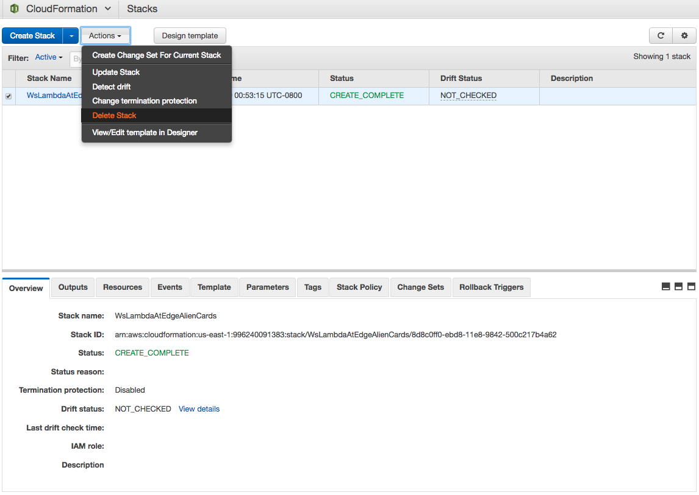

## Cleanup

In [AWS CloudFormation Console](https://console.aws.amazon.com/cloudformation/home?region=us-east-1), select the stack created for this wokrshop. Under `Actions`, click `Delete Stack`.

Show/hide the screenshot

  
<kbd></kbd>

 

In about 10 minutes, all AWS resouces created for this workshop by the CloudFormation stack (an S3 bucket, DynamoDB table, CloudFront distribution, IAM roles) will be deleted from your AWS account.

The Lambda functions you manually created in the labs are not deleted with the CloudFormation stack. You can delete them in AWS Lambda Console.
