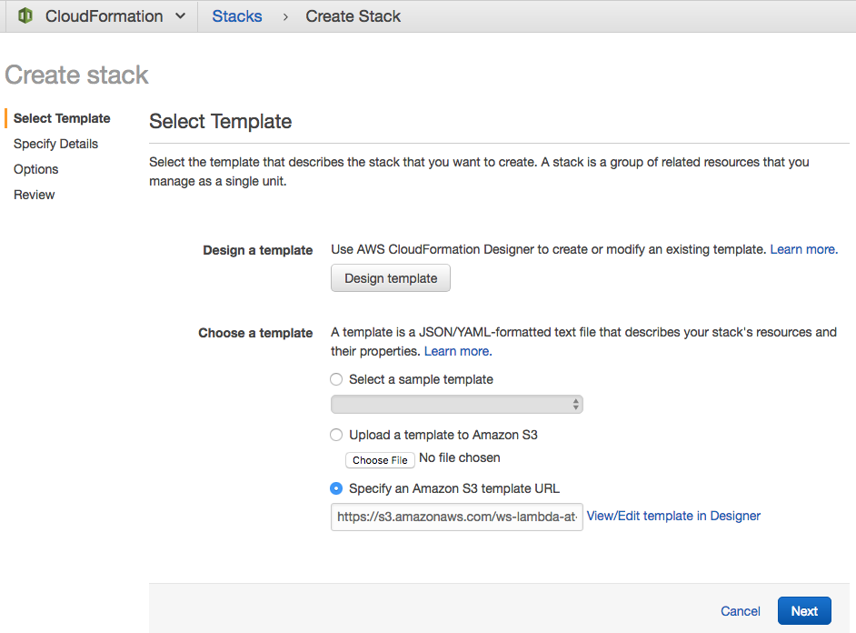
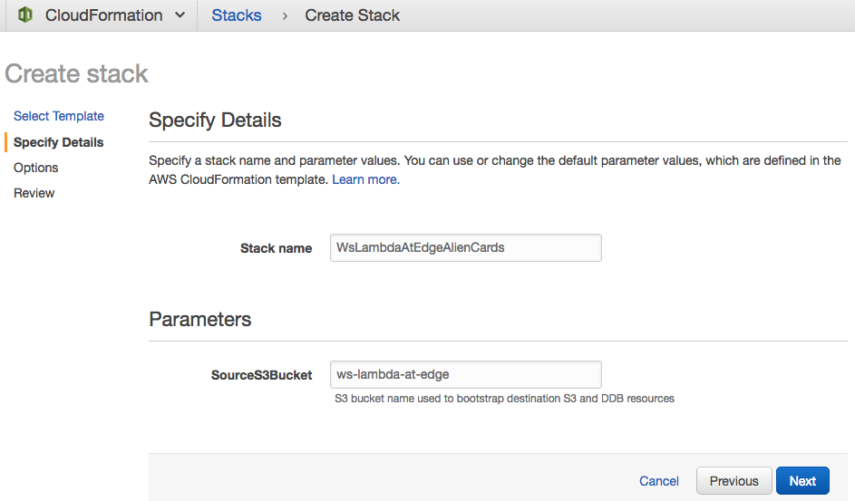
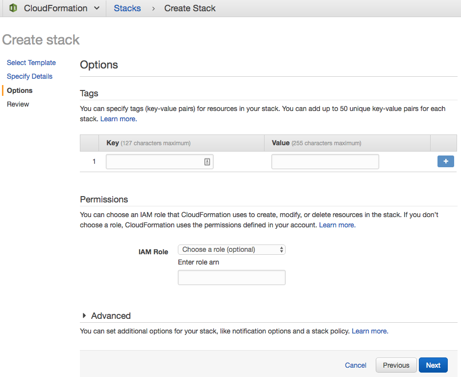
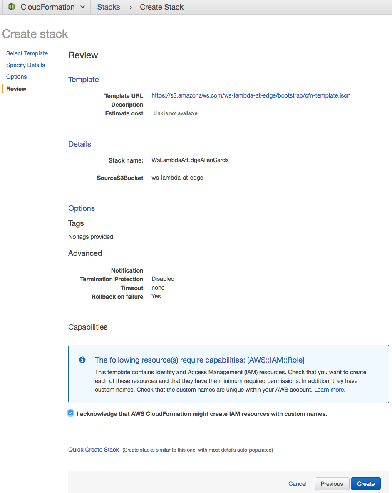
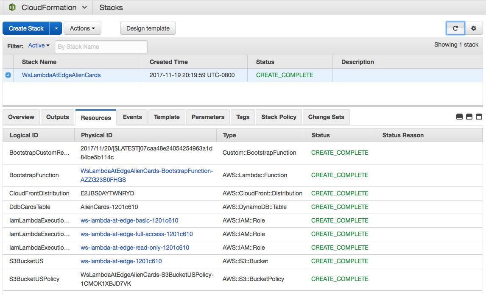
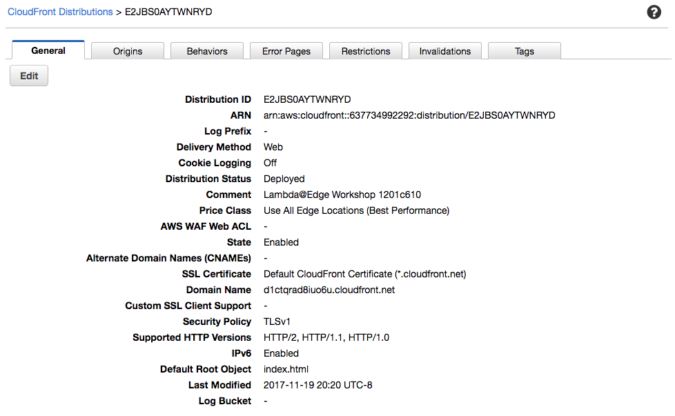

## Lab 0 - Launch the Stack

### 1. Launch the stack

#### 1.1 Start

Click the link to kick off the process.

Region | Button
------------ | -------------
us-east-1 | 

#### 1.2 Step "Select Template"

Click "Next"

#### 1.3 Step "Specify Details", click "Next"

Leave the default values for "Stack name" and "SourceS3Bucket" as is.

Click "Next".

#### 1.4 Step "Options", click "Next"

No tags or advanced options needed.

Click "Next".

#### 1.5 Step "Review"

Click "I acknowledge that AWS CloudFormation might create IAM resources with custom names".

Click "Next".

#### 2 Wait for CloudFormation to create the stack

You can monitor the progress in CloudFormation console.

Wait for the "Status" to become "CREATE_COMPLETE" for all resources.

When completed the list of created resources on the "Resources" tab should look like this.

#### 3 Navigate to CloudFront Console

The created CloudFront distribution can be found in CloudFront Console and should look like this. Notice the comment "Lambda@Edge Workshop <Unique ID>".

