## Lab 1 - Security

Security always comes first.

Let's check and improve our website security by configuring HTTP to HTTPs redirect and adding a number of standard security headers to enforce HTTPS connection is always used and prevent XSS.

In modern web, many security features are implemented and enforced by web-browsers. Such client side security features are usually enabled and configured by HTTP response headers sent by a web-server. However, web-servers may respond with some or all of the security headers missing. This lab shows how to add security headers to responses from an origin server configured for a CloudFront distribution. In our case, the origin is an S3 bucket.

First we will scan our website by observatory.mozilla.org and see if it finds any security features missing. Next, we will fix potential security vulnerabilities by adding several security headers to all HTTP responses.

## Steps

[1. Scan the website for security vulnerabilities](#1-scan-the-website-for-security-vulnerabilities)  
[2. Create a Lambda function](#2-create-a-lambda-function)  
[3. Validate the function works in Lambda Console](#3-validate-the-function-works-in-lambda-console)  
[4. Publish a function version](#4-publish-a-function-version)  
[5. Create the trigger](#5-create-the-trigger)  
[6. Configure HTTP to HTTPs redirect](#6-configure-http-to-https-redirect)  
[7. Wait for the change to propagate](#7-wait-for-the-change-to-propagate)  
[8. Invalidate CloudFront cache](#8-invalidate-cloudfront-cache)   
[9. Validate the security headers are now seen in the HTTP responses](#9-validate-the-security-headers-are-now-seen-in-the-http-responses)  
[10. Rescan the website for security](#10-rescan-the-website-for-security)  

### 1. Scan the website for security vulnerabilities

Go to https://observatory.mozilla.org/ and scan the CloudFront distribution domain name created for you by the CloudFormation stack, `d123.cloudfront.net`.

**NOTE**: Here and below throughout the workshop, replace the example domain name `d123.cloudfront.net` with the unique domain name of your CloudFront distribution.

The result of the scan will be unsatisfactory:

<kbd>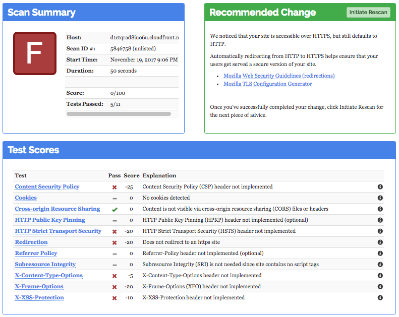</kbd>

### 2. Create a Lambda function

Create a Lambda function that would add the security headers to all responses from the origin in the CloudFront distribution.

**Note**: CloudFormation stack was created in "US West (Oregon)" and for Lambda@Edge, lambda function needs to be created in "US East (N.Virginia)" region only.

Go to Lambda Console, select "US East (N.Virginia)" region in the top right corner. Go to `Functions`, click `Create function` and click `Author from scratch`.

In the `Basic information` window, specify:
* `Name`: `ws-lambda-at-edge-add-security-headers`
* `Runtime`: `Node.js 6.10` or `Node.js 8.10`
* `Role`: `Choose an existing role`
* `Existing role`: `ws-lambda-at-edge-basic-<UNIQUE_ID>` (this allows the function to push the logs to CloudWatch Logs)

<kbd>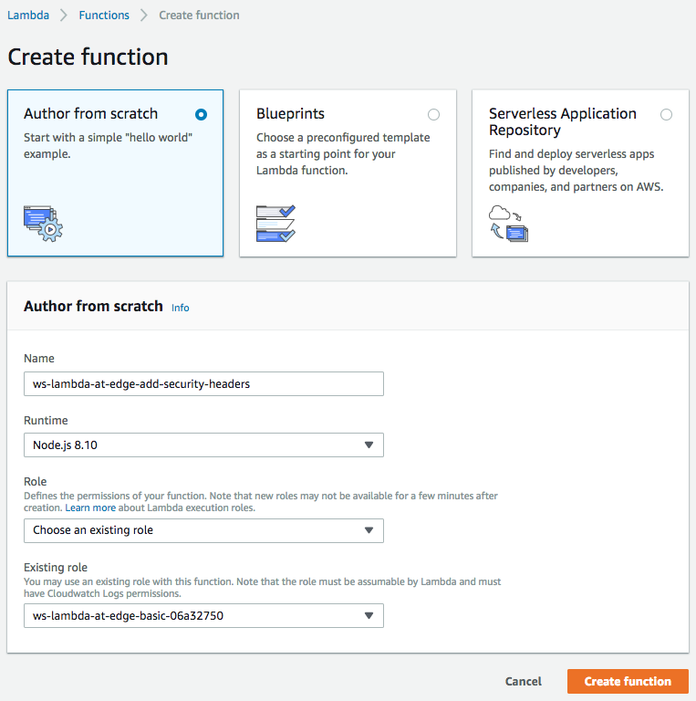</kbd>

Use JavaScript code from [ws-lambda-at-edge-add-security-headers.js](./ws-lambda-at-edge-add-security-headers.js) as a blueprint.

Take a moment to familiarize yourself with the function code and what it does.

<kbd>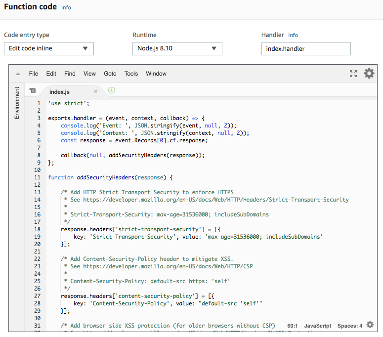</kbd>

### 3. Validate the function works in Lambda Console

When the function is created and is ready to be associated with a CloudFront distribution, it's highly recommended to first test it to make sure it executes successfully and produces the expected outcome. This can be done using a test invoke in Lambda Console. Click `Save` and then `Test`.

You will be prompted with a window that allows you to create a test event - an input for your function. Use the event template called `CloudFront Modify Response Header`.

<kbd>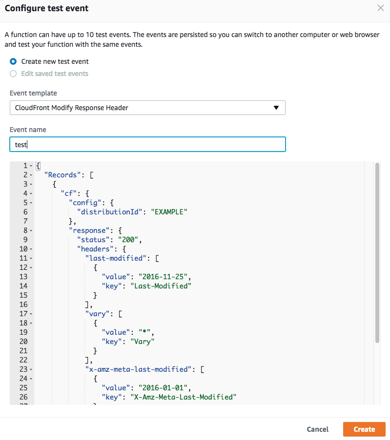</kbd>

Now the function can be tested with the configured test event. Click `Test`.
Validate that the security headers are now seen in the the execution result of the test invocation.

<kbd>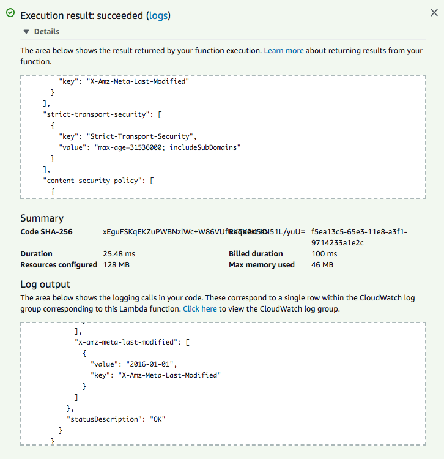</kbd>

### 4. Publish a function version

Before a Lambda function can be associated with and triggered by a CloudFront distribution, you need to "publish" it to get a function version ARN. This "freezes" the function code and configuration so that you can further modify the function while CloudFront still uses the immutable function version.

Choose `Publish new version` under `Actions`, specify an optional description of a function version and click `Publish`.

<kbd>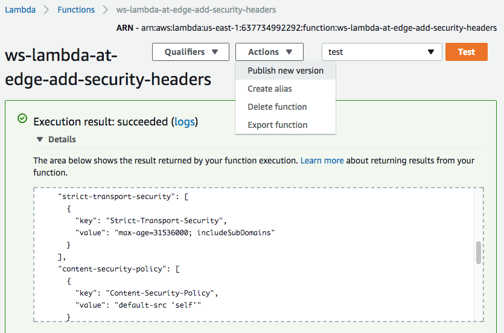</kbd>

Now you have a published function version ARN.

<kbd>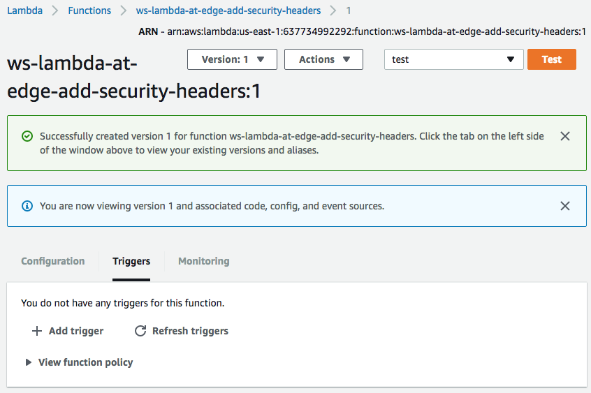</kbd>

### 5. Create the trigger

The next step is to configure a CloudFront distribution to trigger the Lambda function execution on one of the four event types. This can be done in both Lambda or CloudFront Consoles.

While we are at the Lambda Console, under `Configuration` select `CloudFront` from the dropdown list of AWS services, you will be presented with a `Configure triggers`. 

<kbd>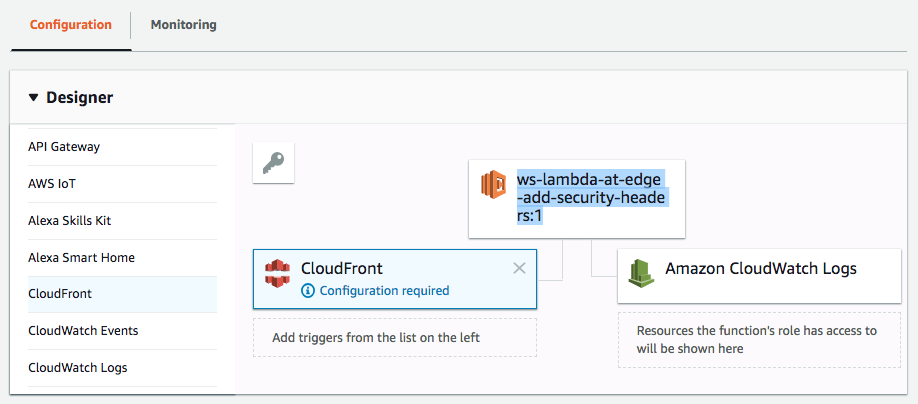</kbd>

Set the new trigger properties as follows:

* `Distribution ID`: find the CloudFront distribution created for this workshop  
* `Cache Behavior`: choose the default cache behavior, that is currently the only behavior in the distribution that matches all URI paths with the `*` wildcard.  
* `CloudFront Event`: choose `Origin Response` event type to trigger the function. We want to add the security headers every time we receive a response from the origin so that the modified response would be cached together with the added security headers in the CloudFront cache.
* Confirm the global replication of the function by clicking `Enable trigger and replicate`.
* Click `Add` and then `Save`.

<kbd>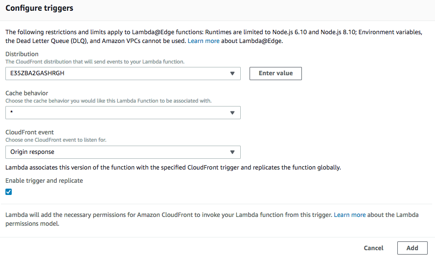</kbd>

<kbd>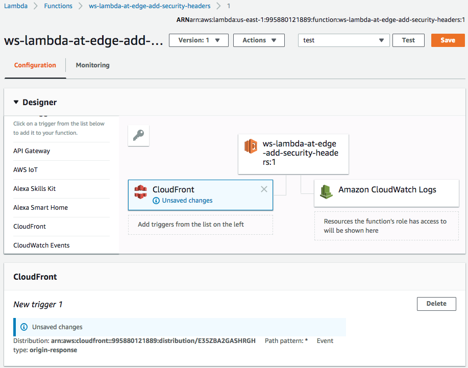</kbd>

After the trigger has been created, you will see it in the list of triggers of the function version.

<kbd>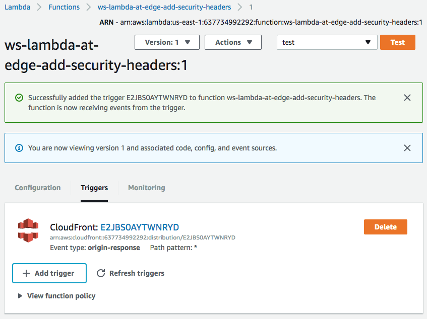</kbd>

### 6. Configure HTTP to HTTPs redirect

Besides adding the security headers to all HTTP responses, it is also recommended to redirect HTTP traffic to the HTTPS URLs with the same URI location. This can be easily enabled in the CloudFront Console.

Open CloudFront Console and find the distribution created for this workshop. Navigate to the `Behaviors` tab and open the default cache behavior:
* Set `Viewer Protocol Policy` to `Redirect HTTP to HTTPs`
* You can also see the Lambda function ARN here configured for `Origin Response` event type in the previous step. No action needed. This is just another way to configure the trigger association in CloudFront Console.

<kbd>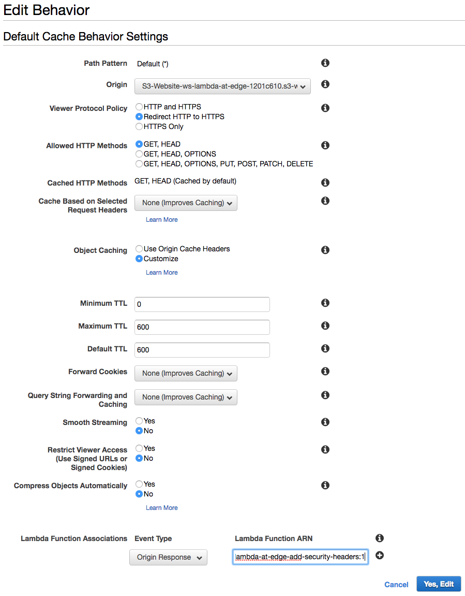</kbd>

### 7. Wait for the change to propagate

After any modification of a CloudFront distribution, the change propagates globally to all CloudFront edge locations. The propagation status is indicated as `In Progress` and `Deployed` when it's complete. Usually ~30-60seconds is enough for the change to take effect, even though the status may be still `In Progress`. To be 100% certain though you can wait until the change is fully deployed, but it's not needed for the purpose of the workshop.

### 8. Invalidate CloudFront cache

In order to purge any objects that may have been cached without the security headers, submit a wildcard invalidation '/*'.

<kbd>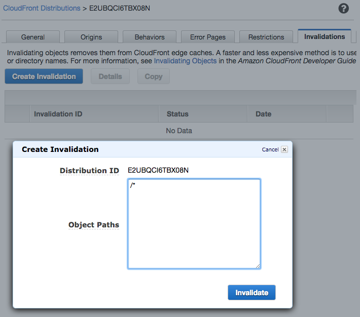</kbd>

### 9. Validate the security headers are now seen in the HTTP responses

You can validate that the security headers are now being added to all responses to your CloudFront distribution. You can use browser developer tools or a command line. This step can be skipped.

```
curl --head https://d123.cloudfront.net
HTTP/1.1 200 OK
... <more headers> ...
Content-Security-Policy: default-src 'self'
Strict-Transport-Security: max-age=31536000; includeSubDomains
X-Content-Type-Options: nosniff
X-Frame-Options: DENY
X-XSS-Protection: 1; mode=block
... <more headers> ...
```

### 10. Rescan the website for security

Rescan the distribution domain name with https://observatory.mozilla.org/ similar to step 1.

Congratulations, now you have 100/100 score! :)

<kbd>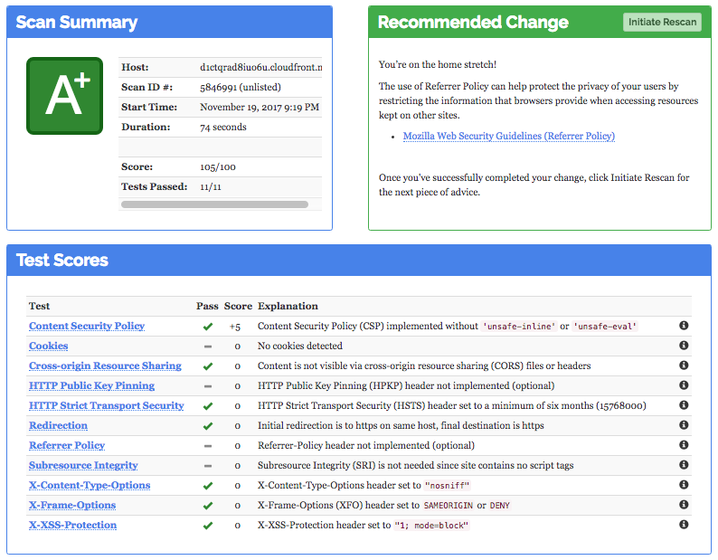</kbd>

<kbd>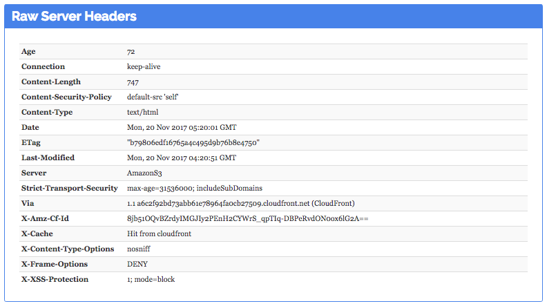</kbd>
