## Lab 1 - Security

Security always comes first.

In modern web, many security features are implemented and enforced by the web browsers. The client-side security features are usually enabled and configured by HTTP response headers sent by a web server. However, a web server may not include all of the desired security headers in responses sent to your clients.

In this lab, we will first scan our website to its security can be improved. We will then enhance the security of your CloudFront distribution using Lambda@Edge. We will add several response headers to enable web browsers security features. For example, the `Strict-Transport-Security` response header protects your viewers from certain categories of the man-in-the-middle attacks, and the `Content-Security-Policy` header helps prevent cross-site scripting (XSS), clickjacking, and other code injection attacks resulting from execution of malicious content in the trusted web page context. We will also configure your CloudFront distribution to always require HTTPS for communication between your viewers and CloudFront. All HTTP requests received by CloudFront will be redirected a corresponding HTTPS URL.

## Steps

[1. Scan the website for security vulnerabilities](#1-scan-the-website-for-security-vulnerabilities)  
[2. Create a Lambda function](#2-create-a-lambda-function)  
[3. Validate the function works in Lambda Console](#3-validate-the-function-works-in-lambda-console)  
[4. Deploy to Lambda@Edge](#4-deploy-to-lambdaedge)  
[5. Configure HTTP to HTTPs redirect](#5-configure-http-to-https-redirect)  
[6. Wait for the change to propagate](#6-wait-for-the-change-to-propagate)  
[7. Invalidate CloudFront cache](#7-invalidate-cloudfront-cache)   
[8. Validate the security headers are now seen in the HTTP responses](#8-validate-the-security-headers-are-now-seen-in-the-http-responses)  
[9. Rescan the website for security](#9-rescan-the-website-for-security)  

### 1. Scan the website for security vulnerabilities

Go to https://observatory.mozilla.org/ and scan the CloudFront distribution domain name created for you by the CloudFormation stack, `d123.cloudfront.net`.

**NOTE**: Here and below throughout the workshop, replace the example domain name `d123.cloudfront.net` with the unique domain name of your CloudFront distribution.

The result of the scan will be unsatisfactory:

<kbd>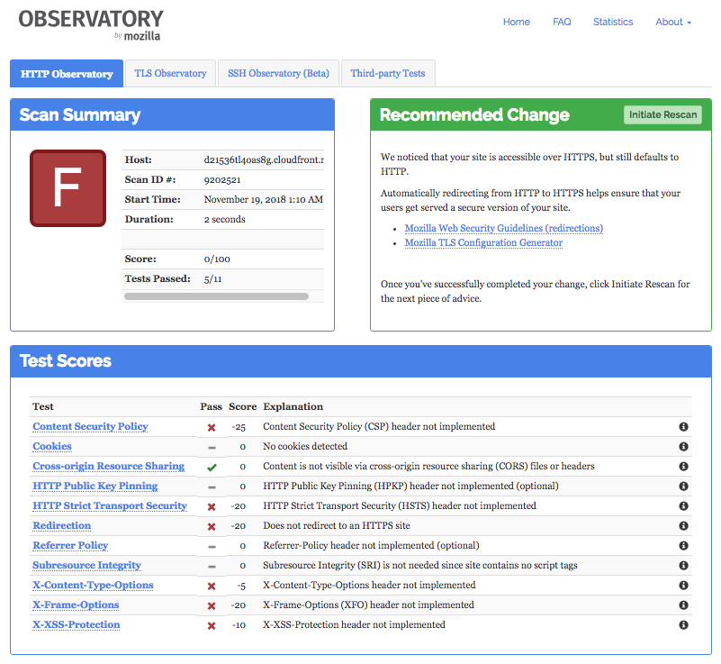</kbd>

### 2. Create a Lambda function

Create a Lambda function that would add the security headers to all responses from the origin in the CloudFront distribution.

Open [AWS Lambda Console](https://console.aws.amazon.com/lambda/home?region=us-east-1#/). Make sure the "US East (N.Virginia)" region is selected in the top right corner. Go to `Functions`, click `Create function` and click `Author from scratch`.

In the `Create function` page, specify:

Field | Value
--- | ---
Name | ws-lambda-at-edge-add-security-headers
Runtime | Node.js 8.10
Role | Choose an existing role
Existing role | ws-lambda-at-edge-basic-<UNIQUE_ID>

<details><summary>Show/hide the screenshot</summary>
  
<kbd>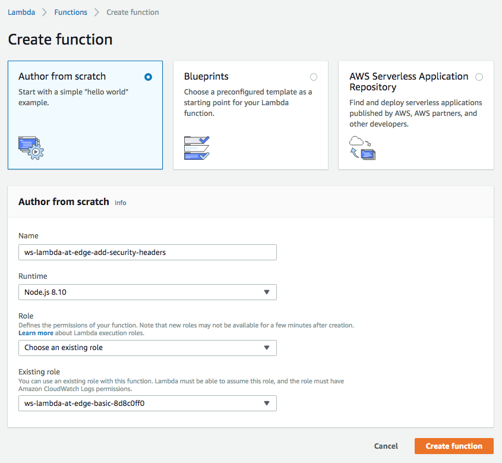</kbd>
</details><br/>

Use JavaScript code from [ws-lambda-at-edge-add-security-headers.js](./ws-lambda-at-edge-add-security-headers.js) as a blueprint. Take a moment to familiarize yourself with the function code and what it does.

<details><summary>Show/hide the screenshot</summary>
  
<kbd>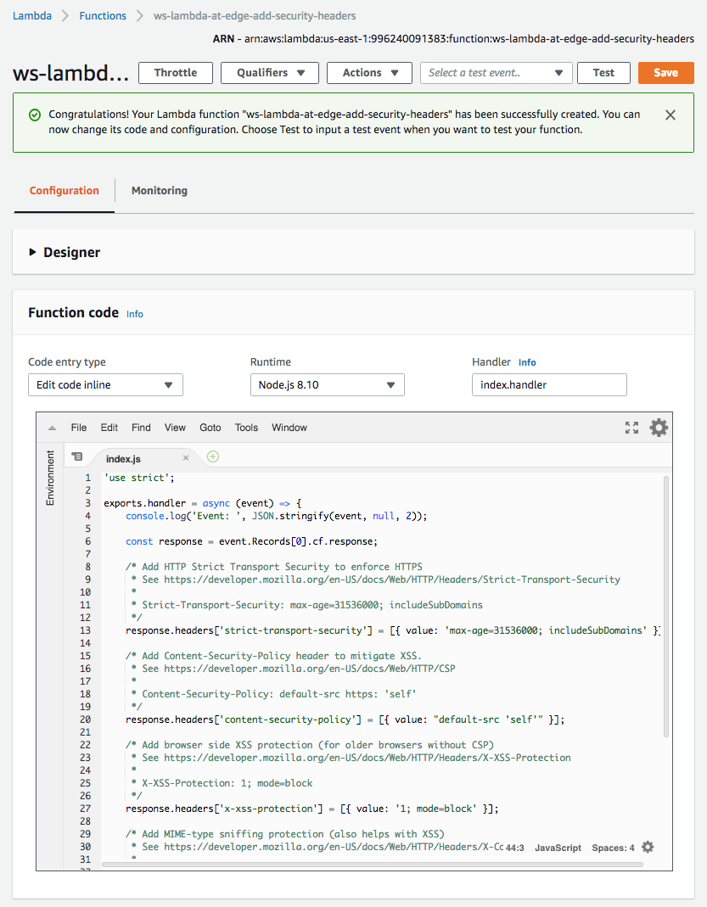</kbd>
</details></br>

Click `Save`.

### 3. Validate the function works in Lambda Console

When the function is created and is ready to be associated with a CloudFront distribution, it's highly recommended to first test it to make sure it executes successfully and produces the expected outcome. This can be done using a test invoke in Lambda Console. Click `Test`.

You will be prompted with a window that allows you to create a test event - an input for your function. Use the event template called `CloudFront Modify Response Header`.

<details><summary>Show/hide the screenshot</summary>
  
<kbd>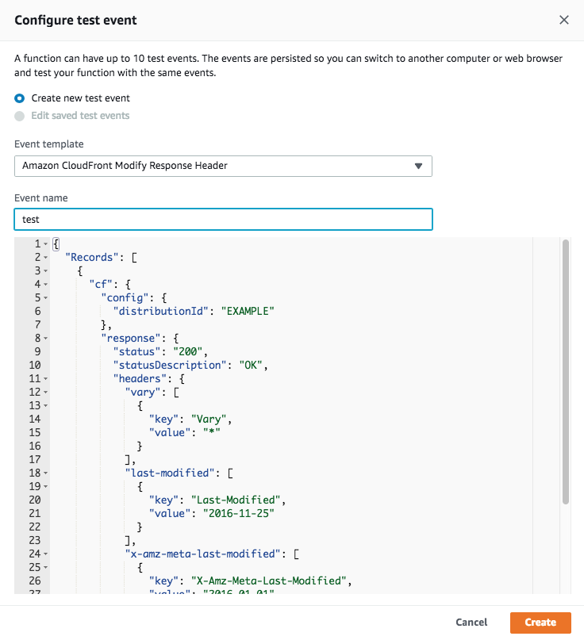</kbd>
</details><br/>

Now the function can be tested with the configured test event. Click `Test`.<br/>
Validate that the security headers are now present in the the execution result of the test invocation.

<details><summary>Show/hide the screenshot</summary>
  
<kbd>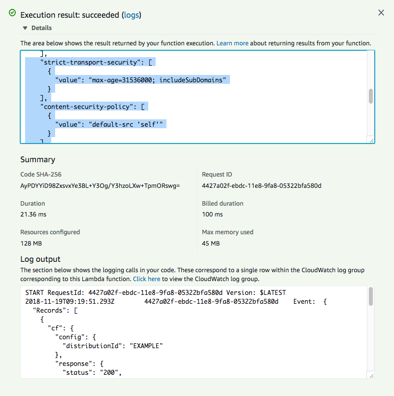</kbd>
</details>

### 4. Deploy to Lambda@Edge

Deploying your function to Lambda@Edge implies two steps: creating a function version, and associating the function version with your CloudFront distribution by selecting an applicable Cache Behavior and an event trigger type (viewer request, viewer response, origin request or origin response).

Publishing a function version means creating an immutable snapshot of your function. By associating an immutable function version with your CloudFront distribution, you ensure that any further changes to the code or the configuration of your Lambda@Edge function does not affect your CloudFront traffic immediately, until you explicitly associate another function version with it. This way you can safely modify your function code and test it, before you associate it with your CloudFront distribution.

You can do both of these steps separately, or alternatively you can do both of them at once by choosing `Deploy to Lambda@Edge` under `Actions`.

<details><summary>Show/hide the screenshot</summary>
  
<kbd>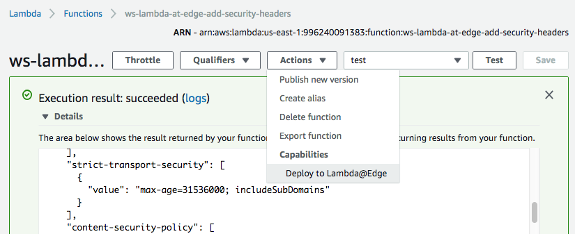</kbd>
</details><br/>

You will be presented with `Deploy to Lambda@Edge` page where you configure the properties of the CloudFront trigger for your Lambda function.

Set the trigger properties as shown below and click `Deploy`

Field | Value
--- | ---
Distribution | Select the distribution created for this workshop
Cache beavior | `*` (the default cache behavior matching all URI paths)
CloudFront event | `Origin response`

<details><summary>Show/hide the screenshot</summary>
  
<kbd>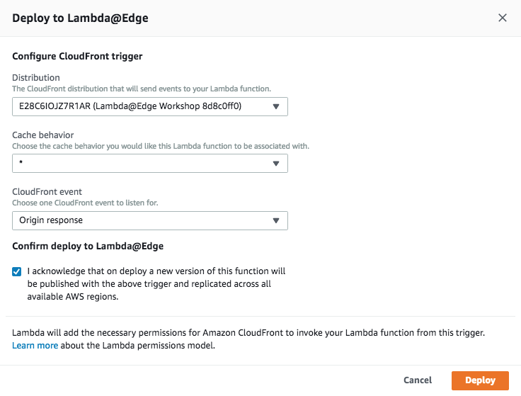</kbd>
</details><br/>

After that, you will see the message the trigger has been successfully created.

<details><summary>Show/hide the screenshot</summary>
  
<kbd>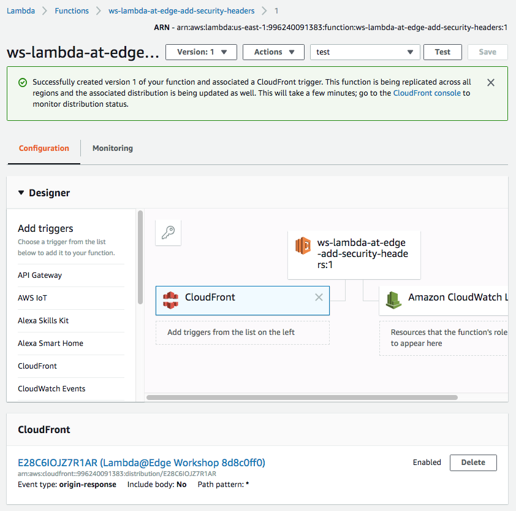</kbd>
</details>

### 5. Configure HTTP to HTTPs redirect

Besides the security headers that we now add to all HTTP responses, it is also recommended to redirect HTTP traffic to the HTTPS URLs with the same URI location. This can be easily enabled in the CloudFront Console.

Open [AWS CloudFront Console](https://console.aws.amazon.com/cloudfront/home?region=us-east-1#) and find the distribution created for this workshop. Navigate to the `Behaviors` tab.

<details><summary>Show/hide the screenshot</summary>
  
<kbd></kbd>
</details><br/>

Select the default cache behavior and click `Edit`. Set `Viewer Protocol Policy` to `Redirect HTTP to HTTPs`.

<details><summary>Show/hide the screenshot</summary>
  
<kbd>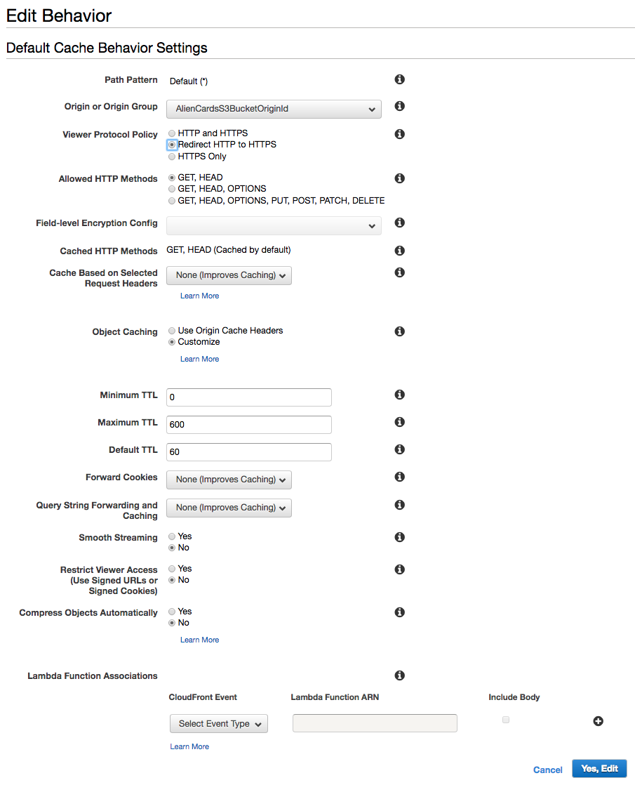</kbd>
</details><br/>

You can also see the Lambda function ARN here configured for `Origin Response` event type in the previous step. No action needed. This is just another way to configure the trigger association in CloudFront Console.

### 6. Wait for the change to propagate

After any modification of a CloudFront distribution, the change propagates globally to all CloudFront edge locations. The propagation status is indicated as `In Progress` and `Deployed` when it's complete. Usually 30-60 seconds is enough for the change to take effect, even though the status may be still `In Progress`. To be 100% certain though you can wait until the change is fully deployed, but it's not needed for the purpose of this workshop.

<details><summary>Show/hide the screenshot</summary>
  
<kbd>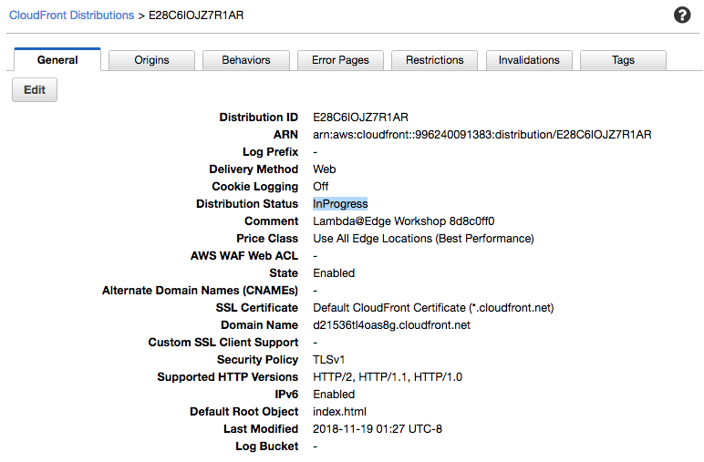</kbd>
</details>

### 7. Invalidate CloudFront cache

In order to purge any objects that may have been cached without the security headers, submit a wildcard invalidation `/*`.

<details><summary>Show/hide the screenshot</summary>
  
<kbd>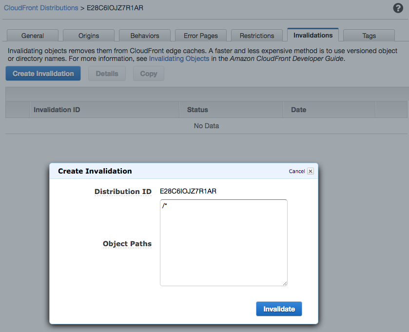</kbd>
<kbd>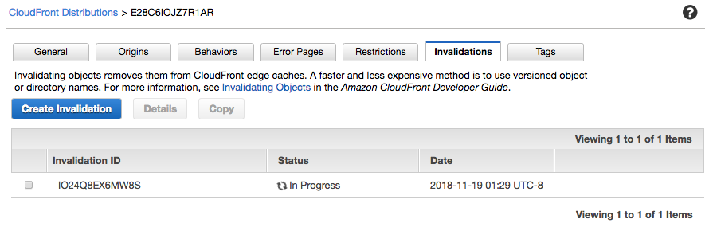</kbd>
</details>

### 8. Validate the security headers are now seen in the HTTP responses

You can validate that the security headers are now being added to all responses to your CloudFront distribution. You can use browser developer tools or a command line. This step can be skipped.

```
curl --head https://d123.cloudfront.net
HTTP/1.1 200 OK
... <more headers> ...
Content-Security-Policy: default-src 'self'
Strict-Transport-Security: max-age=31536000; includeSubDomains
X-Content-Type-Options: nosniff
X-Frame-Options: DENY
X-XSS-Protection: 1; mode=block
... <more headers> ...
```

### 9. Rescan the website for security

Rescan the distribution domain name with https://observatory.mozilla.org/ similar to step 1.

Congratulations, now you have 100/100 score! :)

<kbd>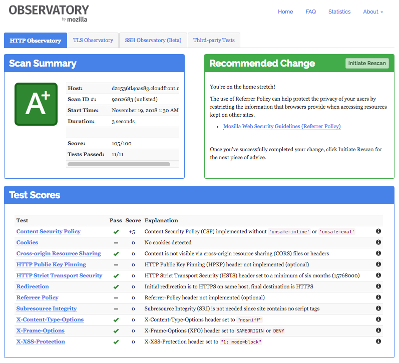</kbd>
