## Lab 2 - Content Generation

With Lambda@Edge you can not only modify requests and responses by changing URIs, cookies, headers and query strings, but you can also generate content by returning a response object from a Lambda function triggered by viewer-request or origin-request events. In this case, instead of further processing the request, CloudFront will respond back to the viewer with the content generated by your Lambda function.

In this lab, you will learn how to create a Lambda function that dynamically generates HTML content that can be cached by CloudFront and returned back to your viewers.

If you navigate your web browser to the domain name of the CloudFront distribution created by CloudFormation for this workshop, you will find that the distribution just points to an S3 bucket with some static HTML content and jpeg images.

The home page of the CloudFront distribution displays a static HTML page with a list of images:  
https://d123.cloudfront.net

**NOTE:** Here and below throughout the workshop, replace the example domain name `d123.cloudfront.net` with the unique domain name of your distribution.

If you click on a particular image, you will be forwarded to a jpeg image:  
https://d123.cloudfront.net/card/960w/da8398f4.jpg

In this lab, we will create two Lambda functions:
* The first Lambda function will generate a simple HTML page with card details available at the URL like this:  
https://d123.cloudfront.net/card/da8398f4  (currently, it shows `404 Not Found` from S3)
* The second Lambda function will generate a new dynamic home page showing details about each of the displayed cards - description and the current rating. It will also sort the cards so that the most popular ones are displayed at the top.

We will generate the content in Lambda functions triggered by origin-request event so that the generated HTML files can be cached by CloudFront. Even if the TTL is a few seconds, it will still absorb traffic spikes and lower the number of function invocations.

## Steps

[1. Content generation for the card details page](#1-content-generation-for-the-card-details-page)  
[1.1 Create a Lambda function](#11-create-a-lambda-function)  
[1.2 Validate the function works in Lambda Console](#12-validate-the-function-works-in-lambda-console)  
[1.3 Publish a function version](#13-publish-a-function-version)  
[1.4 Create the trigger](#14-create-the-trigger)  
[1.5 Wait for the change to propagate](#15-wait-for-the-change-to-propagate)  
[1.6 The generated card details page is now served by CloudFront](#16-the-generated-card-details-page-is-now-served-by-cloudfront)  

[2. Content generation for the home page](#2-content-generation-for-the-home-page)  
[2.1 Create a lambda function](#21-create-a-lambda-function)  
[2.2 Validate the function works in Lambda Console](#22-validate-the-function-works-in-lambda-console)  
[2.3 Publish a function version](#23-publish-a-function-version)  
[2.4 Create a cache behavior for the home page](#24-create-a-cache-behavior-for-the-home-page)  
[2.5 Wait for the change to propagate](#25-wait-for-the-change-to-propagate)  
[2.6 The generated home page is now served by CloudFront!](#27-the-generated-home-page-is-now-served-by-cloudfront)  

### 1. Content generation for the card details page

Let's create a Lambda function that generates HTML responses for the card details page, such as  
https://d123.cloudfront.net/card/da8398f4

#### 1.1 Create a Lambda function

Go to Lambda Console, select "US East (N.Virginia)" region in the top left corner. Go to `Functions`, click `Create function` and click `Author from scratch`.

In the `Basic information` window, specify:
* `Name`: `ws-lambda-at-edge-generate-card-page`
* `Runtime`: `Node.js 6.10` or `Node.js 8.10`
* `Role`: `Choose an existing role`
* `Existing role`: `ws-lambda-at-edge-read-only-<UNIQUE_ID>` (this role allows the function to read data from the DynamoDB table and get objects from the S3 buckets)

<kbd>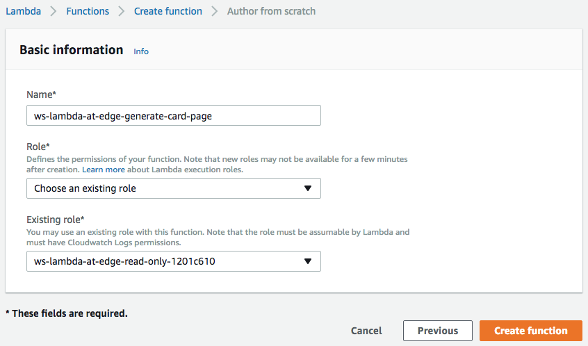</kbd>

Use JavaScript code from [ws-lambda-at-edge-generate-card-page.js](./ws-lambda-at-edge-generate-card-page.js) as a blueprint.

Take a moment to familiarize yourself with the function code and what it does. You will need to replace `FIXME` with the DynamoDB table name and the CloudFront distribution domain name. You can find the resource names in the CloudFormation stack details in CloudFormation Console, or directly in DynamoDB and CloudFront Consoles.

<kbd>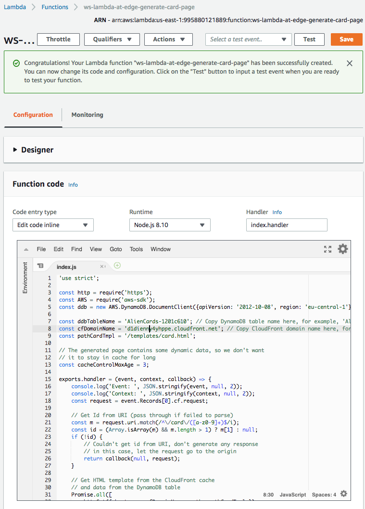</kbd>

#### 1.2 Validate the function works in Lambda Console

Click `Save` and configure the test event. You can use `CloudFront Simple Remote Call` event template. 

Specify `/card/da8398f4` as the value of the `uri` field.

<kbd>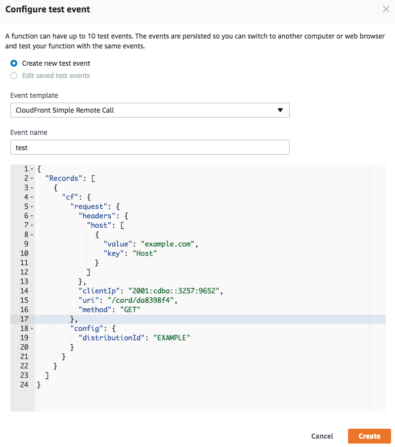</kbd>

Click `Test` and validate the function has returned `200` status code and the `body` field contains a meaningful HTML document.

<kbd>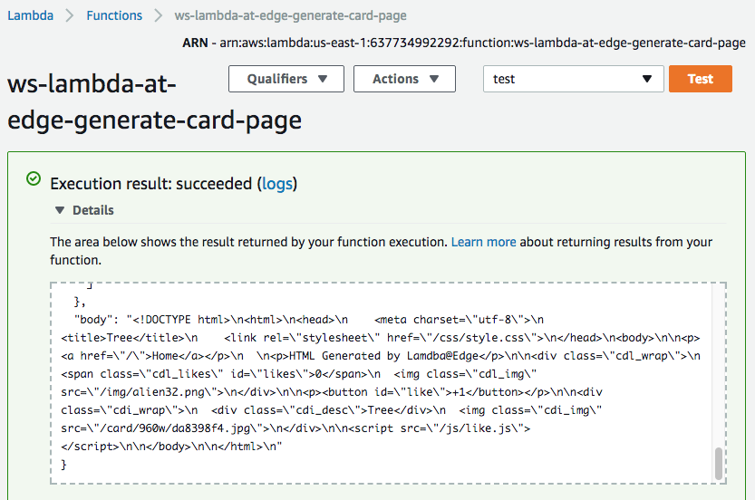</kbd>

#### 1.3 Publish a function version

Choose `Publish new version` under `Actions`, specify an optional description of a function version and click `Publish`.

<kbd>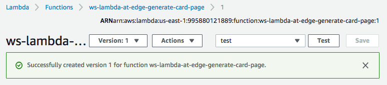</kbd>

#### 1.4 Create the trigger

Under `Configuration`, select `CloudFront` from the dropdown list of AWS services, you will be presented with a `Configure triggers`. 

Set the new trigger properties as follows:

* `Distribution ID`: find the CloudFront distribution created for this workshop  
* `Cache Behavior`: choose the default cache behavior, that is currently the only behavior in the distribution that matches all URI paths with the `*` wildcard.  
* `CloudFront Event`: choose `Origin Request` event type to trigger the function.
* Confirm the global replication of the function by clicking `Enable trigger and replicate`.
* Click `Add` and then `Save`.

<kbd>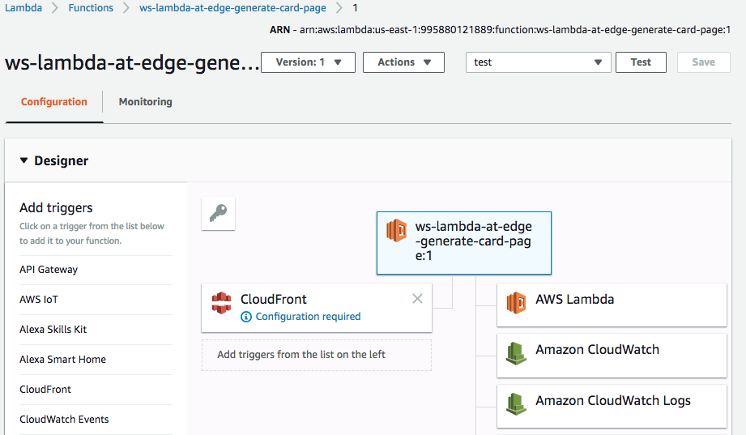</kbd>

<kbd>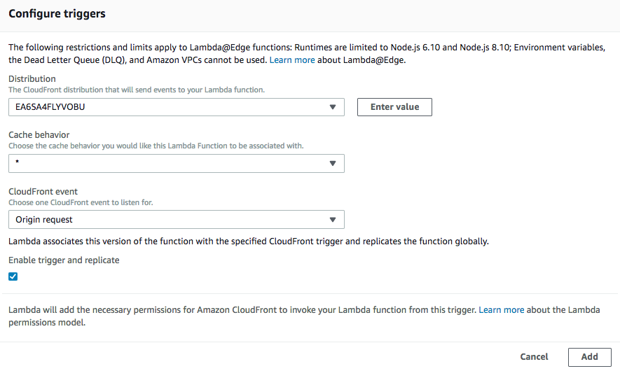</kbd>

<kbd>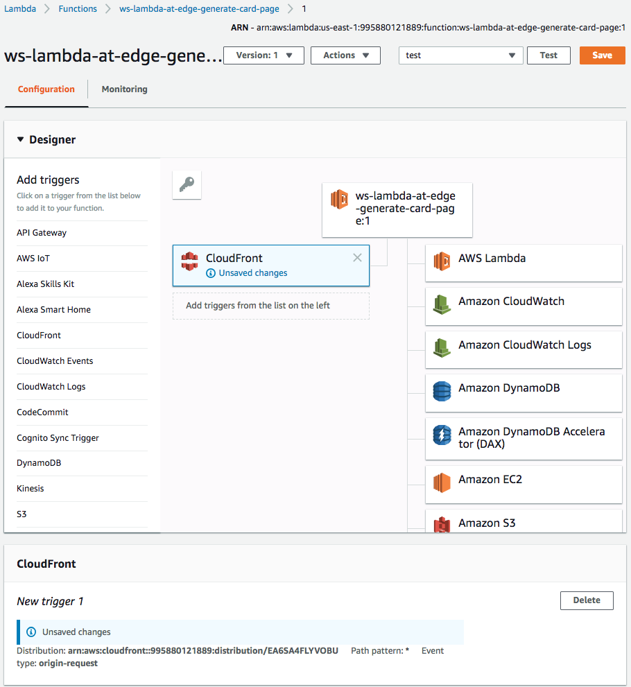</kbd>

After the trigger has been created, you will see it in the list of triggers of the function version.

<kbd>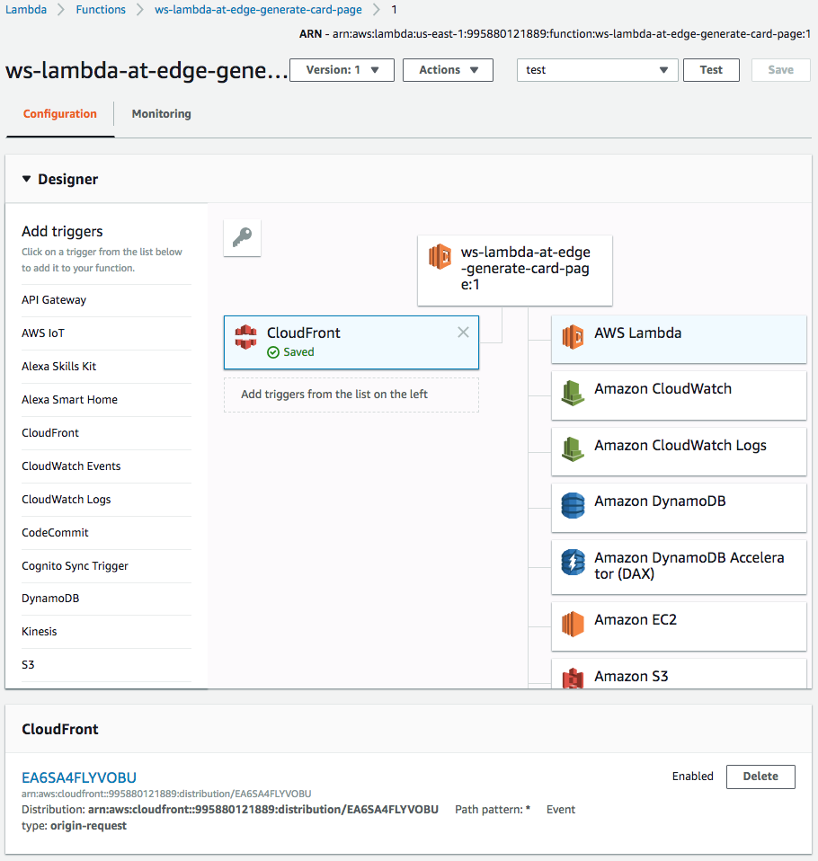</kbd>

#### 1.5 Wait for the change to propagate

Wait for ~30-60 seconds for the change to propagate and for the Lambda function to get globally replicated.

#### 1.6 The generated card details page is now served by CloudFront

Go to the card details page:  
https://d123.cloudfront.net/card/da8398f4  

You should be seeing a page like this:

<kbd>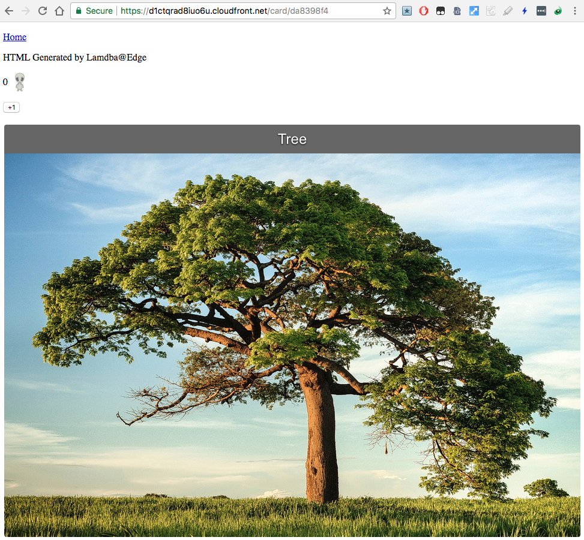</kbd>

### 2. Content generation for the home page

At the moment, the home page of our distribution displays just a static HTML file. Let's make it more dynamic by generating it on the fly with Lambda@Edge so that the cards with the highest rating appear on the top and also a short card description pop ups over the image on mouse hover.

The home page is available at:  
https://d123.cloudfront.net/

#### 2.1 Create a lambda function

Create a Lambda function similar to the previous one.

In the `Basic information` window, select:
* `Name`: `ws-lambda-at-edge-generate-home-page`
* `Runtime`: `Node.js 6.10` or `Node.js 8.10`
* `Role`: `Choose an existing role`
* `Existing role`: `ws-lambda-at-edge-read-only-<UNIQUE_ID>` (this role allows the function to read data from the DynamoDB table and get objects from the S3 buckets)

Use JavaScript code from [ws-lambda-at-edge-generate-home-page.js](./ws-lambda-at-edge-generate-home-page.js) as a blueprint. Take a moment to familiarize yourself with the function code and what it does.

<kbd>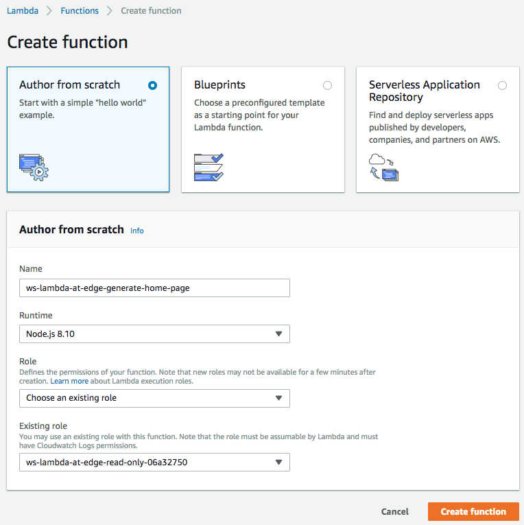</kbd>

<kbd>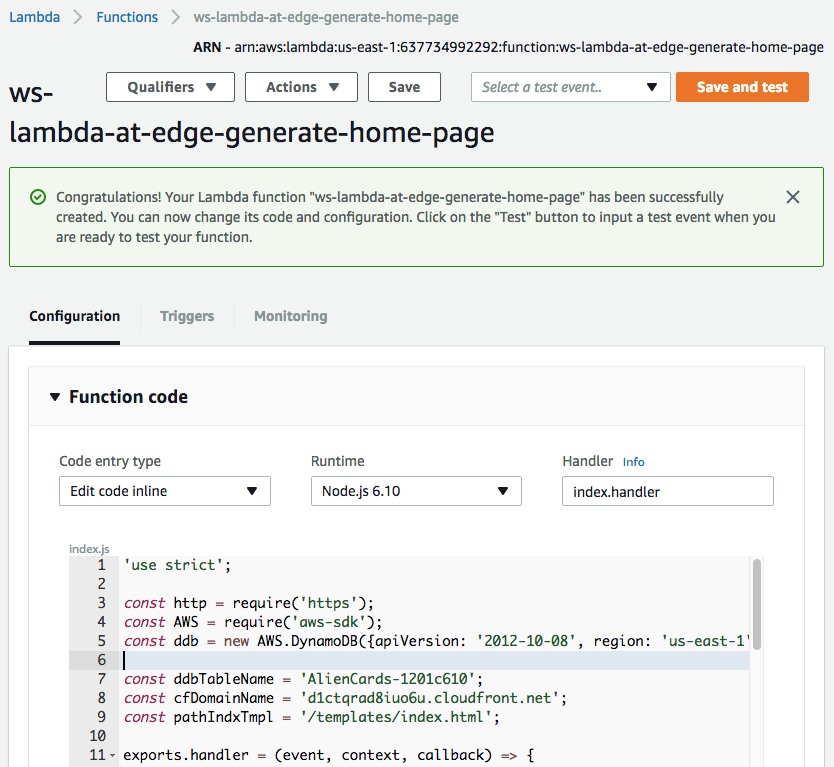</kbd>

#### 2.2 Validate the function works in Lambda Console

Click `Save` and then `Test` and configure the test event. You can use `CloudFront Simple Remote Call` event template.

Specify `/index.html` as the value of the `uri` field.

<kbd>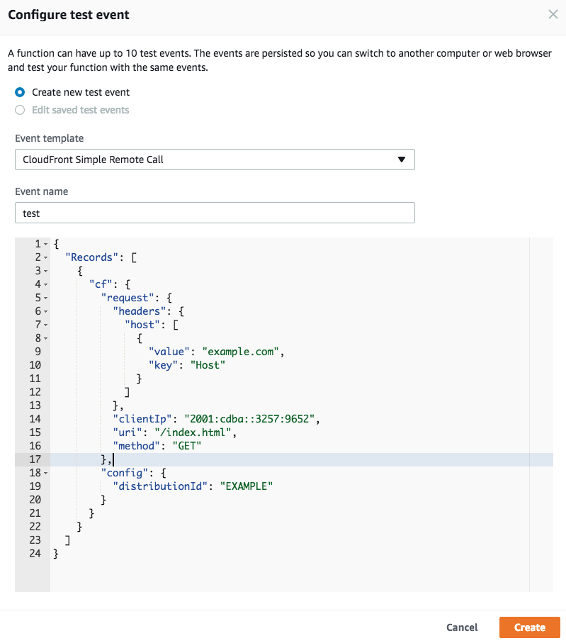</kbd>

Click `Test` and validate the function has returned `200` status code and the `body` field contains a meaningful HTML document.

<kbd>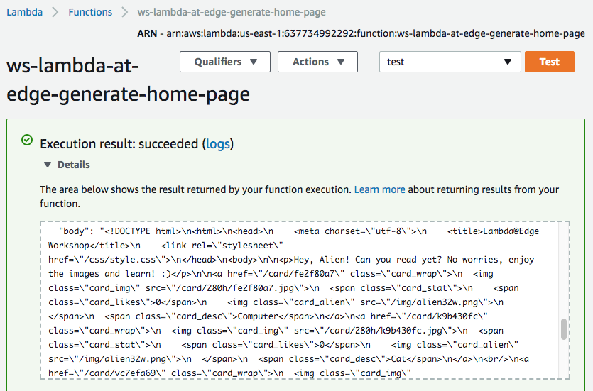</kbd>

#### 2.3 Publish a function version

Choose `Publish new version` under `Actions`, specify an optional description of a function version and click `Publish`.

<kbd>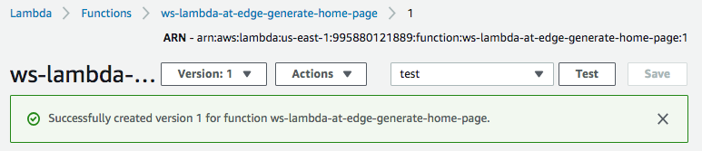</kbd>

#### 2.4 Create a cache behavior for the home page

Go to CloudFront Console and find the distribution created for this workshop.

Under the `Behaviors` tab, click `Create Behavior`. Choose the following settings:
* `Path Pattern`: `/index.html`
* `Viewer Protocol Policy`: `Redirect HTTP to HTTPS`
* `Object Caching`: `Customize`
* Min, Max and Default TTL: 0, 5, 5 respectively (this would cache the generated home page for 5 seconds max)
* `Lambda Function Associations`: `Origin Request` = `<lambda version ARN from the previous step>`
  
<kbd>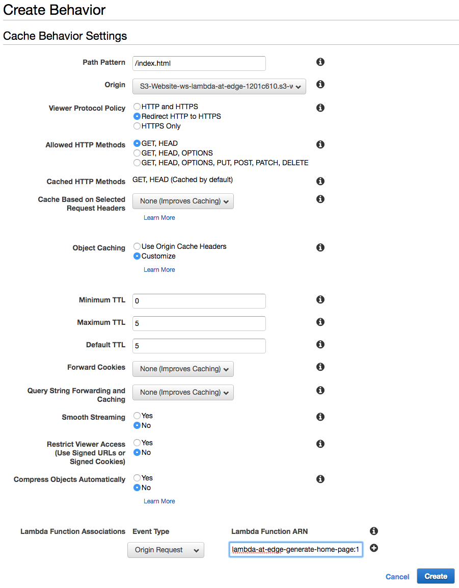</kbd>

#### 2.5 Wait for the change to propagate

After any modification of a CloudFront distribution, the change propagates globally to all CloudFront edge locations. The propagation status is indicated as `In Progress` and `Deployed` when it's complete. Usually ~30-60seconds is enough for the change to take effect, even though the status may be still `In Progress`. To be 100% certain though you can wait until the change is fully deployed, but it's not needed for the purpose of the workshop.

#### 2.6 The generated home page is now served by CloudFront!

Go to the home page:  
https://d123.cloudfront.net/  

You should be seeing a page like this:

<kbd></kbd>
