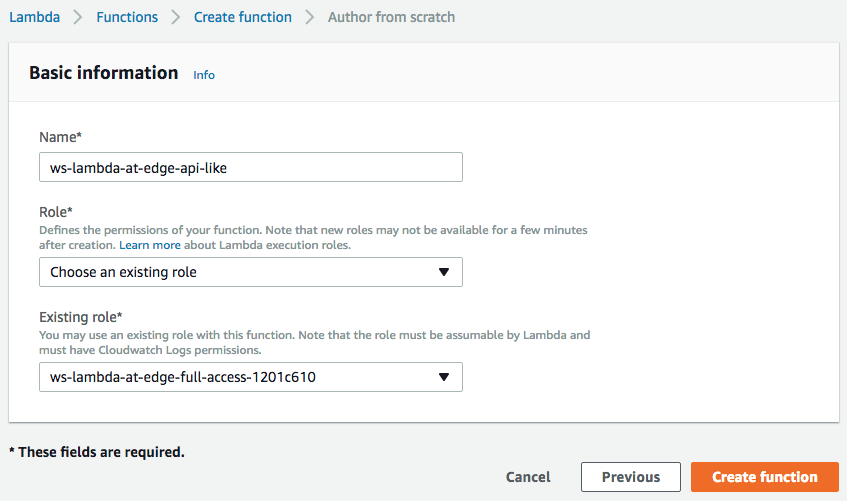
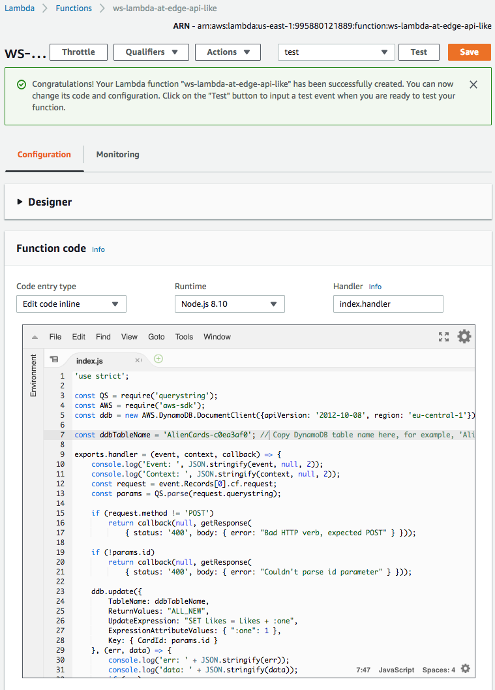
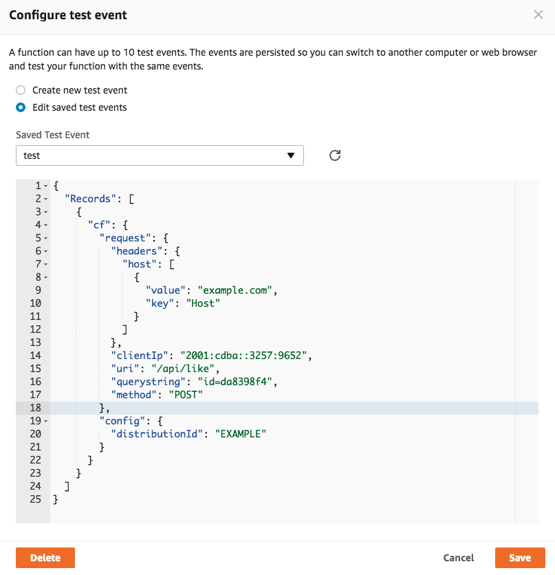
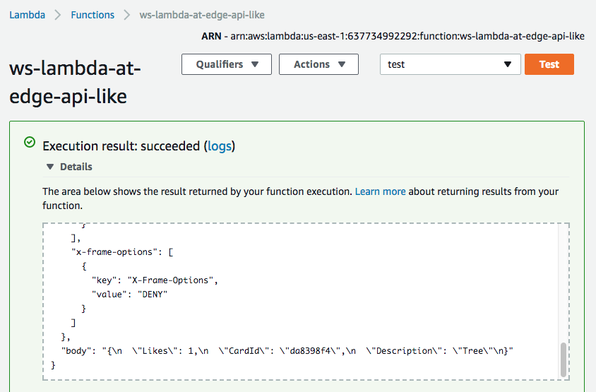
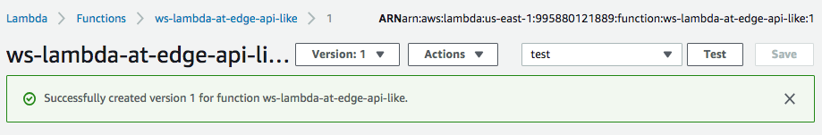
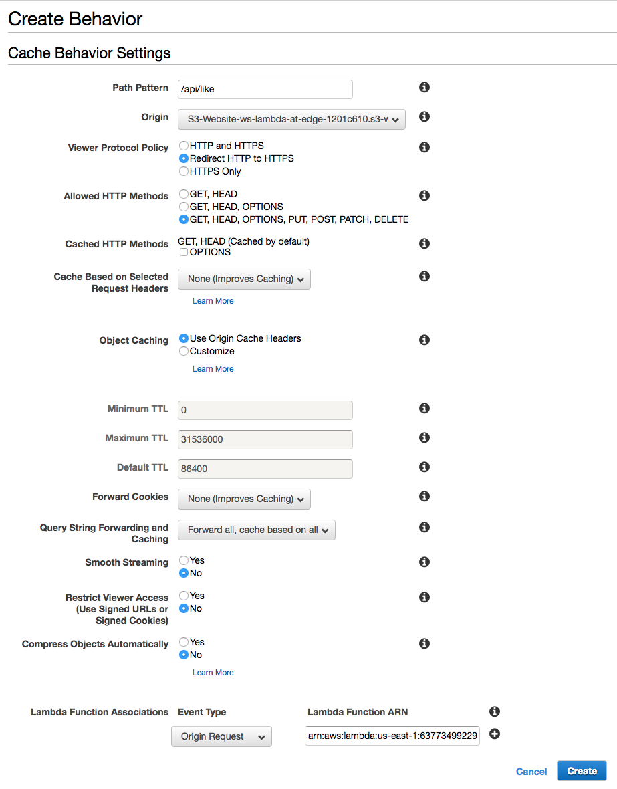
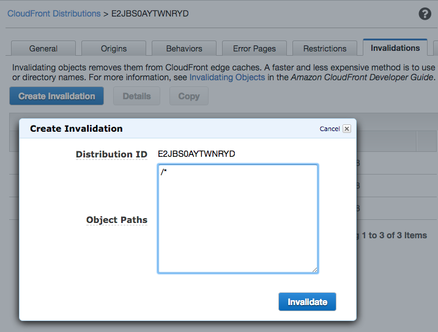
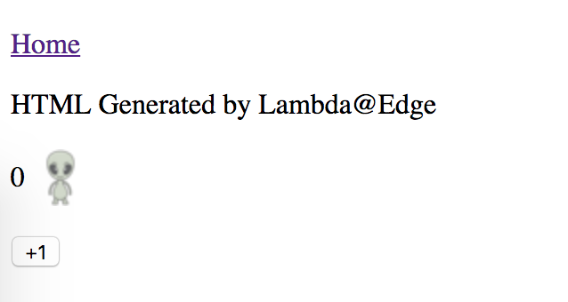
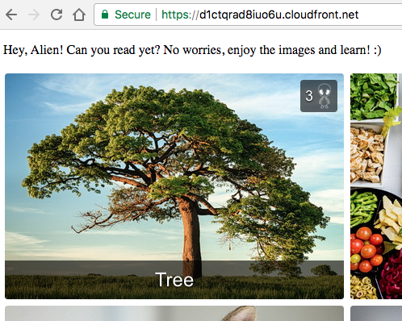

## Lab 3: Simple API

In order to make our simple website a little bit more interactive let's accept some feedback from the viewers and reflect it in the dynamically generated pages. In the previous lab, we made our home page list the cards according to their ratings, but we have not yet implemented a way for our viewers to submit the "+1" feedback.

In this lab, you will learn how you can use Lambda@Edge to implement a simple API that accepts POST requests from the viewers and modifies the web application state in a DynamoDB table.

Let's implement an API that accepts HTTP POST requests in the format below and increments the rating of a card in the DynamoDB table:
```
POST /api/like?id=<card_id>
```

## Steps

[1. Create a Lambda function](#1-create-a-lambda-function)  
[2. Validate the function works in Lambda Console](#2-validate-the-function-works-in-lambda-console)  
[3. Publish a function version](#3-publish-a-function-version)  
[4. Create cache behavior for the API URI](#4-create-cache-behavior-for-the-api-uri)  
[5. Invalidate CloudFront cache](#5-invalidate-cloudfront-cache)  
[6. The API works now!](#6-the-api-works-now)  

### 1. Create a Lambda function

Similar to how we did it in the previous labs, create a Lambda function in t"US East (N.Virginia)" region.

In the `Basic information` window, specify:
* `Name`: `ws-lambda-at-edge-api-like`
* `Role`: `Choose an existing role`
* `Existing role`: `ws-lambda-at-edge-full-access-<UNIQUE_ID>` (this role allows the function to update the DynamoDB table)



Use JavaScript code from [ws-lambda-at-edge-api-like.js](./ws-lambda-at-edge-api-like.js) as a blueprint.

Take a moment to familiarize yourself with the function code and what it does. You will need to replace `FIXME` with the DynamoDB table name.



### 2. Validate the function works in Lambda Console

Click `Save and Test` and configure the test event. You can use the "CloudFront Simple Remote Call" event template. 

Specify the following request fields:
* `"uri": "/api/like"`
* `"querystring": "id=da8398f4"`
* `"method": "POST"`



Click `Test` and validate the function has returned `200` status code and the `body` field contains a meaningful JSON document.



### 3. Publish a function version

Choose `Publish new version` under `Actions`, specify an optional description of a function version and click `Publish`.



### 4. Create cache behavior for the API URI

Go to CloudFront Console and find the distribution created for this workshop.

Under the `Behaviors` tab, click `Create Behavior`. Choose the following settings:
* `Path Pattern`: `/api/like`
* `Viewer Protocol Policy`: `Redirect HTTP to HTTPS`
* `Allowed HTTP Methods`: `GET, HEAD, OPTIONS, PUT, POST, PATCH, DELETE` (so that it includes `POST`)
* `Query String Forwarding and Caching`: `Forward all, cache based on all`
* `Lambda Function Associations`: `Origin Request` = `<lambda version ARN from the previous step>`
  


Wait for ~30-60 seconds for the change to propagate and for the Lambda function to get globally replicated.

### 5. Invalidate CloudFront cache

CloudFront may have already cached the error response code if you tried to click "+1" before implementing the API.

Go to `Invalidations` tab and create a new invalidation. Specify '/*' as the path to invalidate.



### 6. The API works now!

You can validate it with either a command line:

```
curl -X POST https://d123.cloudfront.net/api/like?id=da8398f4
{
  "Likes": 4,
  "CardId": "da8398f4",
  "Description": "Tree"
}
```
Or simple go to https://d123.cloudfront.net/card/da8398f4 in your web browser and click "+1"



becomes:


The home page should also now reflect the change and list the cards according to their rating:


