## Lab 4: Pretty URLs

Pretty URLs are easy to read and remember. They also help with search engine ranking and allow your viewers to use the descriptive links in social media.

In this lab, we will use Lambda@Edge to introduce pretty semantic URLs to our web application.

Currently, we display card details at the URL like this one:  
`(a)` https://d123.cloudfront.net/card/da8398f4  
an example of the corresponding semantic URL would be something like:  
`(b)` https://d123.cloudfront.net/tree

There are two common ways to serve content with pretty URLs:
* Redirect from semantic URLs similar to `(b)` to the URLs similar to `(a)` accepted by the origin
* Rewrite semantic URLs similar to `(b)` to URLs similar to `(a)` accepted by the origin. This can be done either by the origin itself or by an intermediate proxy.

The URI rewrite approach has two advantages over the redirect:
* Faster content delivery as there is now need for an extra round-trip between the server and the client to handle the redirect
* The semantic URLs stay in the address bar of the web browser

We will cover both of these approaches with Lambda@Edge in this lab.

## Steps

[1. Redirect response generation](#1-redirect-response-generation)  
[1.1 Create a cache behavior](#11-create-a-cache-behavior)  
[1.2 Create a Lambda function](#12-create-a-lambda-function)  
[1.3 Validate the function works in Lambda Console](#13-validate-the-function-works-in-lambda-console)  
[1.4 Deploy to Lambda@Edge](#14-deploy-to-lambdaedge)  
[1.5 Redirects now work!](#15-redirects-now-work)  

[2. URI rewrite](#2-uri-rewrite)  
[2.1 Create/modify the Lambda function](#21-createmodify-the-lambda-function)  
[2.2 Validate the function works in Lambda Console](#22-validate-the-function-works-in-lambda-console)  
[2.3 Deploy to Lambda@Edge](#23-deploy-to-lambdaedge)  
[2.4 URI rewrite now works!](#24-uri-rewrite-now-works)  

### 1. Redirect response generation

Let's generate redirects from the named cards ("tree", "cat", etc) like  
https://d123.cloudfront.net/r/tree  

to the actual card URL  
https://d123.cloudfront.net/card/da8398f4

#### 1.1 Create a cache behavior

In [AWS CloudFront Console](https://console.aws.amazon.com/cloudfront/home?region=us-east-1#), select the distribution created for this workshop.

Under the `Behaviors` tab, click `Create Behavior`. Choose the following settings:

Field | Value
--- | ---
Path Pattern | `/r/*`
Viewer Protocol Policy | `Redirect HTTP to HTTPS`
  
<details><summary>Show/hide the screenshot</summary>
  
<kbd>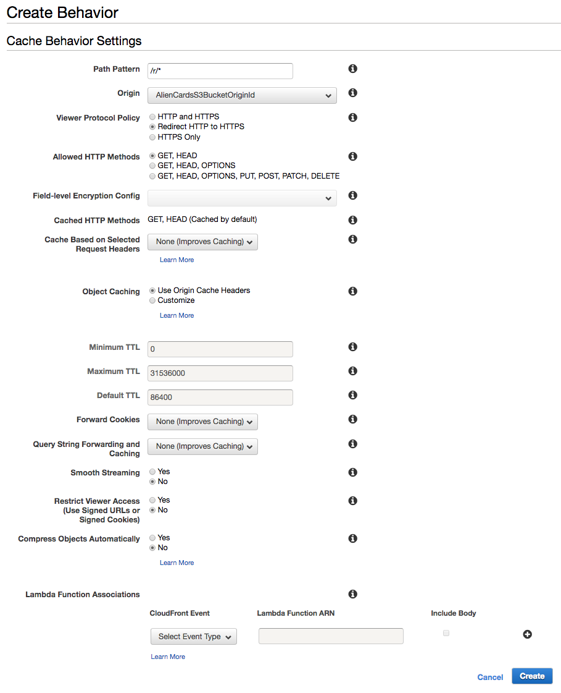</kbd>
</details><br/>

Click `Create`.

<details><summary>Show/hide the screenshot</summary>
  
<kbd>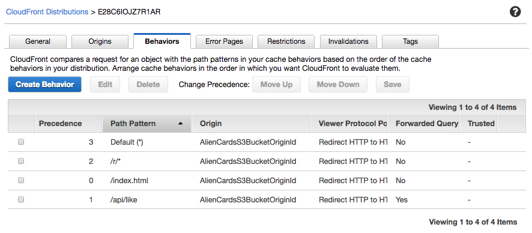</kbd>
</details>

#### 1.2 Create a Lambda function

In [AWS Lambda Console](https://console.aws.amazon.com/lambda/home?region=us-east-1#/), go to `Functions`, click `Create function` and click `Author from scratch`.

In the `Create function` page, specify:

Field | Value
--- | ---
Name | `ws-lambda-at-edge-redirect`
Runtime | `Node.js 8.10`
Role | `Choose an existing role`
Existing role | `ws-lambda-at-edge-basic-<UNIQUE_ID>`

<details><summary>Show/hide the screenshot</summary>
  
<kbd>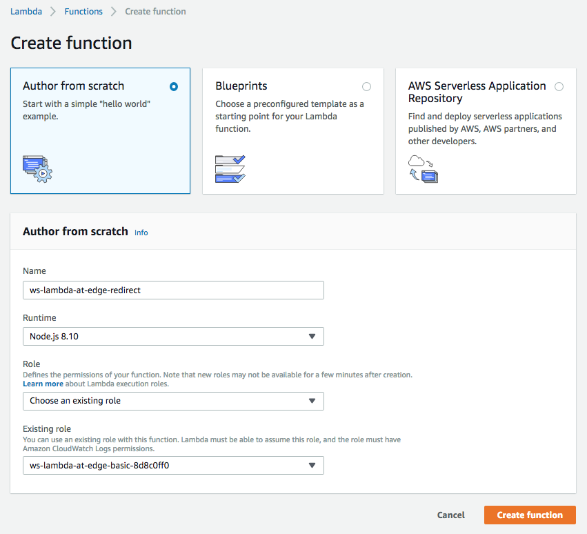</kbd>
</details><br/>

Use JavaScript code from [ws-lambda-at-edge-redirect.js](./ws-lambda-at-edge-redirect.js) as a blueprint.
Take a moment to familiarize yourself with the function code and what it does.

<details><summary>Show/hide the screenshot</summary>
  
<kbd></kbd>
</details><br/>

Click `Save`.

#### 1.3 Validate the function works in Lambda Console

Click `Save`, then `Test`. Configure the test event. Use JSON object from [ws-lambda-at-edge-redirect-test-event.json](./ws-lambda-at-edge-redirect-test-event.json) as the test event. Notice the value of the `uri` field that matches the path pattern of the just cache behavior.

<details><summary>Show/hide the screenshot</summary>
  
<kbd>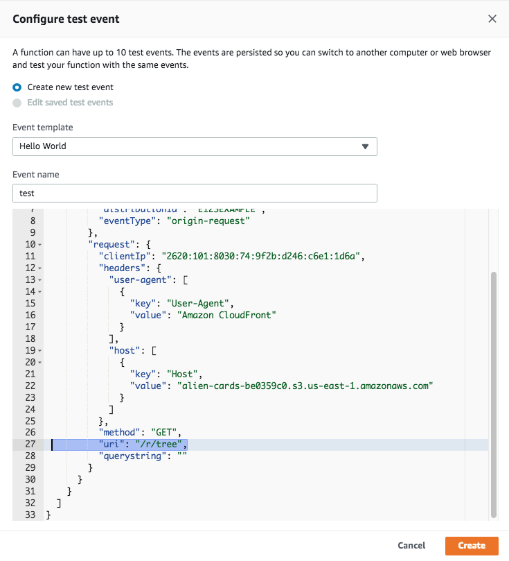</kbd>
</details><br/>

Click `Test` and validate the function has returned `302` redirect response with a proper value of the `location` header.

<details><summary>Show/hide the screenshot</summary>
  
<kbd></kbd>
</details>

#### 1.4 Deploy to Lambda@Edge

Select `Deploy to Lambda@Edge` under `Actions`.
Configure CloudFront trigger properties as shown below, acknowledge replication and click `Deploy`.

Field | Value
--- | ---
Distribution | Select the distribution created for this workshop
Cache beavior | `/r/*`
CloudFront event | `Origin request`

<details><summary>Show/hide the screenshot</summary>
  
<kbd>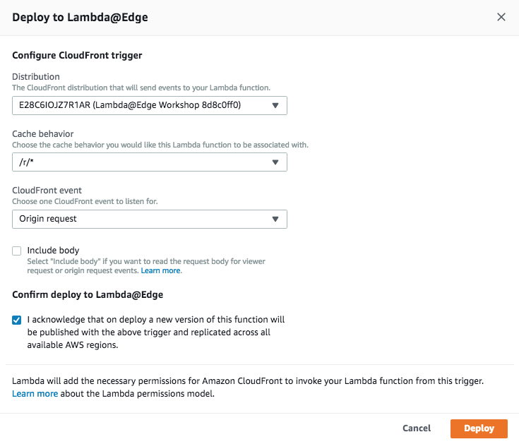</kbd>
</details><br/>

The trigger has been successfully created.

<details><summary>Show/hide the screenshot</summary>
  
<kbd>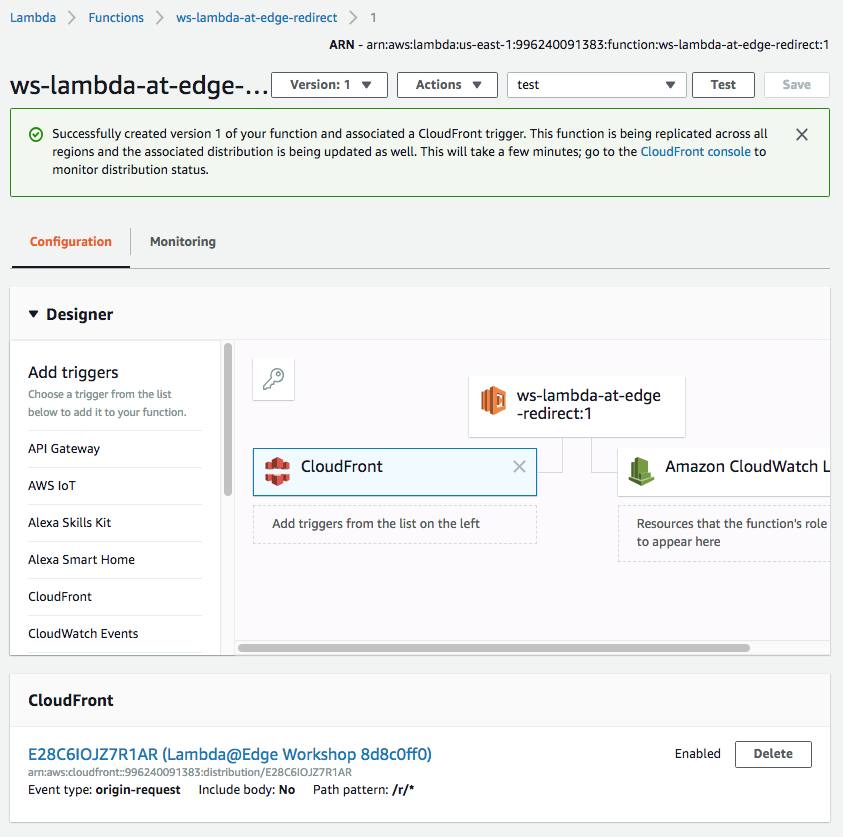</kbd>
</details></br>

Wait for ~30-60 seconds for the change to propagate and for the Lambda@Edge function to get globally replicated.

#### 1.5 Redirects now work!

You can test it with command line:

```
curl --head https://d123.cloudfront.net/r/tree

HTTP/1.1 302 Moved Temporarily
Content-Length: 0
Connection: keep-alive
Server: CloudFront
Date: Tue, 21 Nov 2017 20:08:35 GMT
Location: /card/da8398f4
Age: 41
X-Cache: Hit from cloudfront
Via: 1.1 5d89a565ccf3467bf90667ebfc36953c.cloudfront.net (CloudFront)
X-Amz-Cf-Id: Qz81dgRMzEiac5P5cvxfuXXZRe7ub_MTUQ8PozB1t0ogSkBYSrRMXg==
```

Or by navigating you web browser to  
https://d123.cloudfront.net/r/tree  

which now should be redirected to  
https://d123.cloudfront.net/card/da8398f4  

### 2. URI rewrite

Let's rewrite the pretty URIs ("/tree", "/cat", etc) like  
https://d123.cloudfront.net/tree  
to he actual card URL  
https://d123.cloudfront.net/card/da8398f4  
internally within Lambda@Edge so that it's not even visible in the viewer web browser.

#### 2.1 Create/modify the Lambda function

Assuming [Lab 2 - Content Generation](../Lab2_ContentGeneration/README.md) has been completed, you already have Lambda@Edge function triggered for the origin-request event in the default cache behavior. You now need to rewrite the URI at the beginning of this function before any further processing.

This can be achieved with the code snippet below. Paste it at the beginning of the handler defined in the function `ws-lambda-at-edge-generate-card-page` ([link to AWS Lambda Console](https://console.aws.amazon.com/lambda/home?region=us-east-1#/functions/ws-lambda-at-edge-generate-card-page)) created in Lab 2.

```
const redirects = {
    '/music':    '/card/bcbd2481',
    '/tree':     '/card/da8398f4',
    '/food':     '/card/e51c848c',
    '/computer': '/card/fe2f80a7',
    '/cat':      '/card/k9b430fc',
    '/beer':     '/card/vc7efa69',
};

if (request.uri in redirects) {
    request.uri = redirects[request.uri];
}
```

<details><summary>Show/hide the screenshot</summary>
  
<kbd>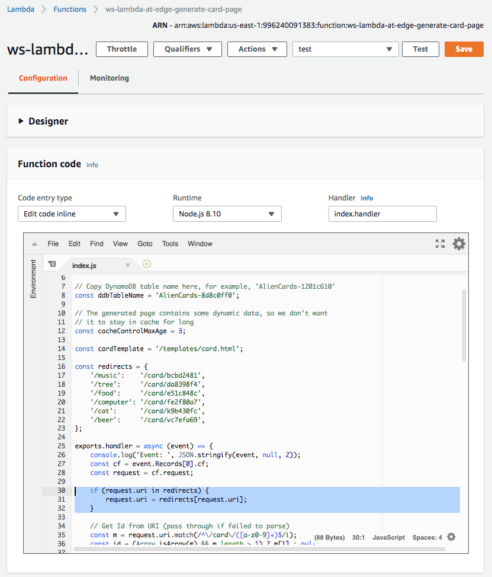</kbd>
</details><br/>

Click `Save`.

#### 2.2 Validate the function works in Lambda Console

Update the test event - click `Configure test events` inside the dropdown list of test events next to the `Test` button.

<details><summary>Show/hide the screenshot</summary>
  
<kbd>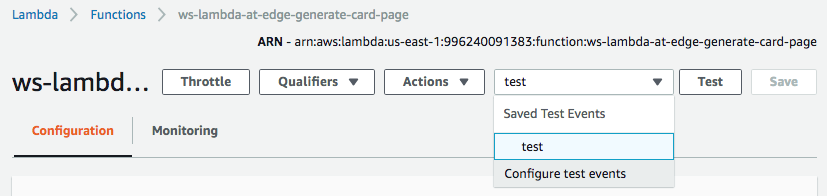</kbd>
</details><br/>

Change the `uri` field value to `"/tree"`. Click `Save`.

<details><summary>Show/hide the screenshot</summary>
  
<kbd>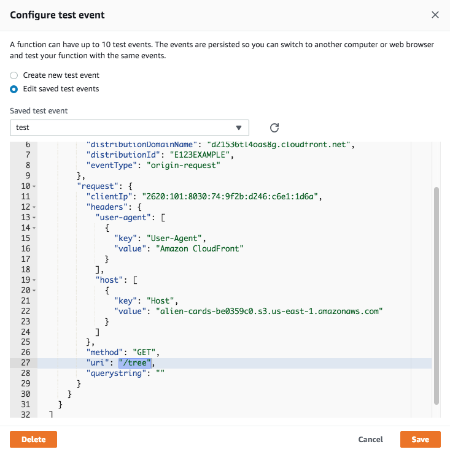</kbd>
</details><br/>

Click `Test` and validate the function has returned `200` response with a proper HTML for the tree card in the body field.

<details><summary>Show/hide the screenshot</summary>
  
<kbd></kbd>
</details>

#### 2.3 Deploy to Lambda@Edge

Select `Deploy to Lambda@Edge` under `Actions`. Because we are updating a trigger already created in Lab 2, choose `Use existing CloudFront trigger on this function`. Click `Deploy`.

<details><summary>Show/hide the screenshot</summary>
  
<kbd>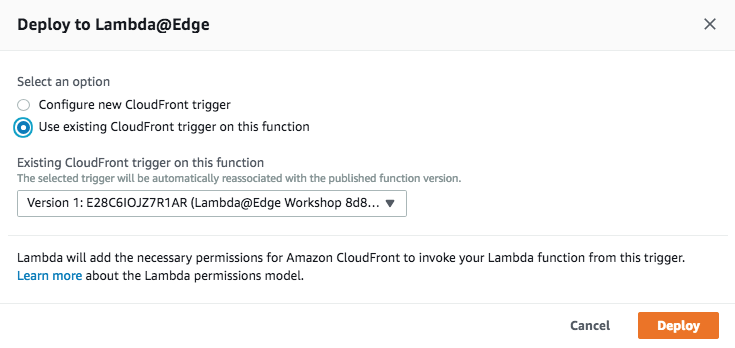</kbd>
</details><br/>

The trigger has been successfully updated.

<details><summary>Show/hide the screenshot</summary>
  
<kbd>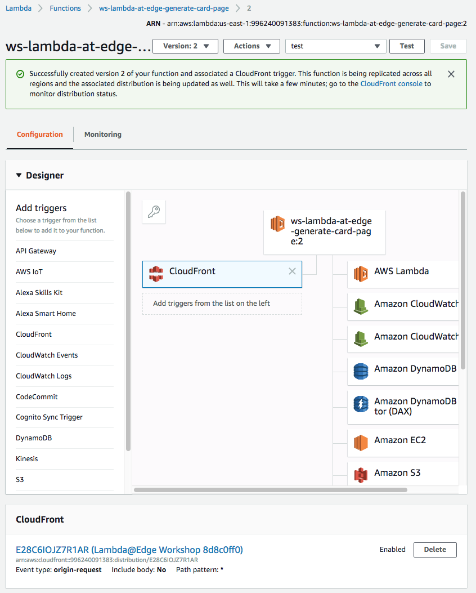</kbd>
</details><br/>

Wait for ~30-60 seconds for the change to propagate and for the Lambda@Edge function to get globally replicated.

#### 2.4 URI rewrite now works!

Now both URLs show exactly the same content.

* https://d123.cloudfront.net/tree
* https://d123.cloudfront.net/card/da8398f4  

<kbd>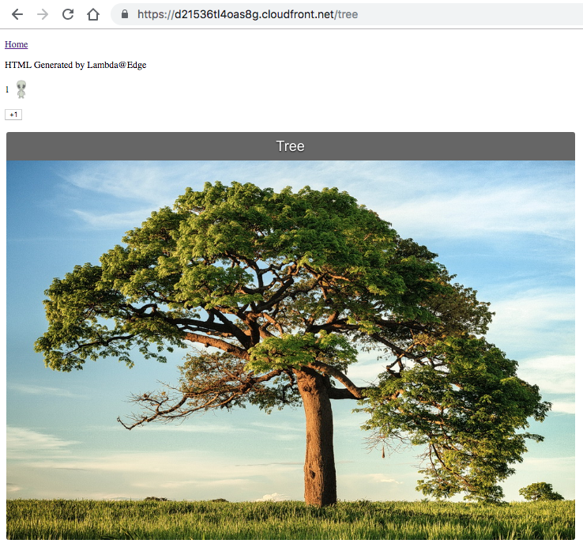</kbd>
