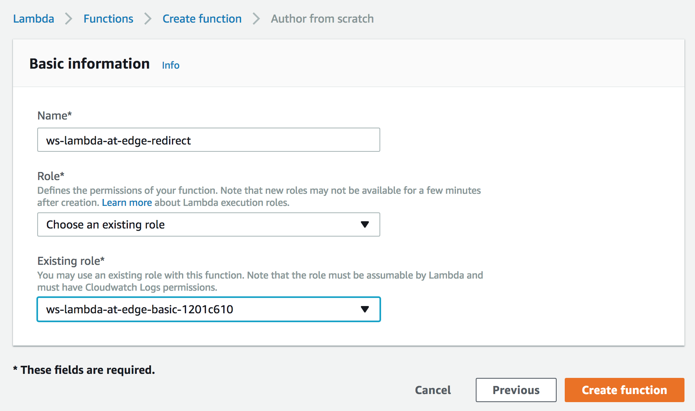
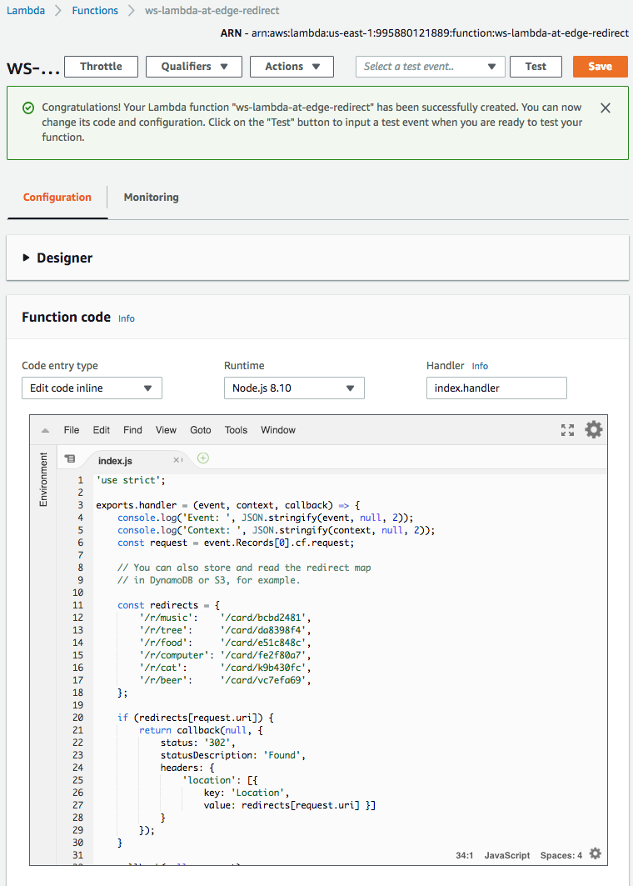
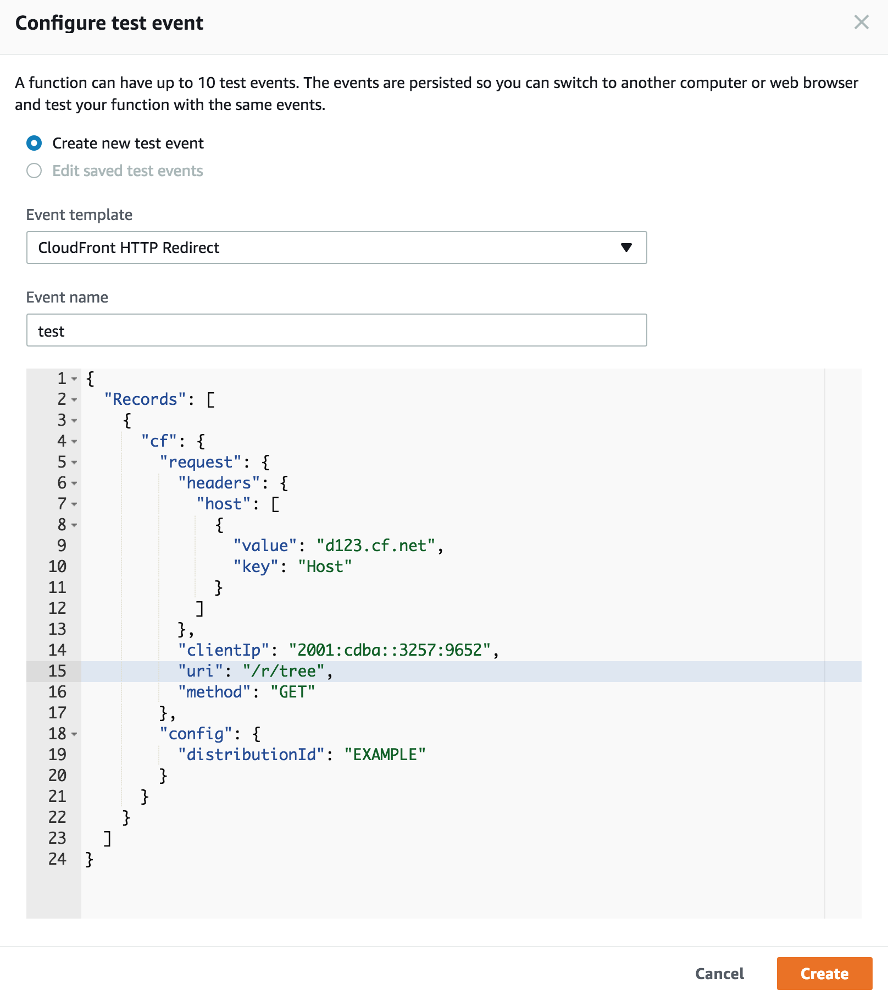
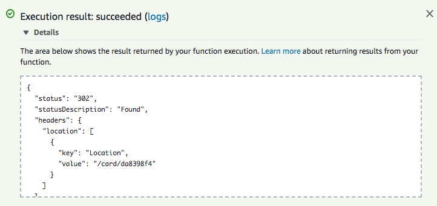
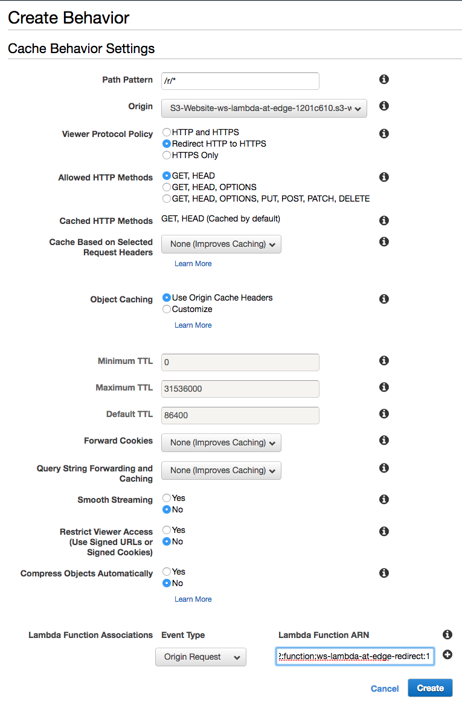
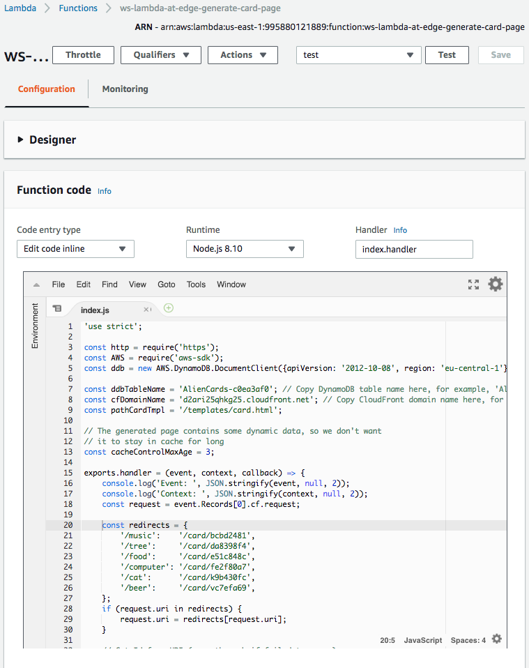
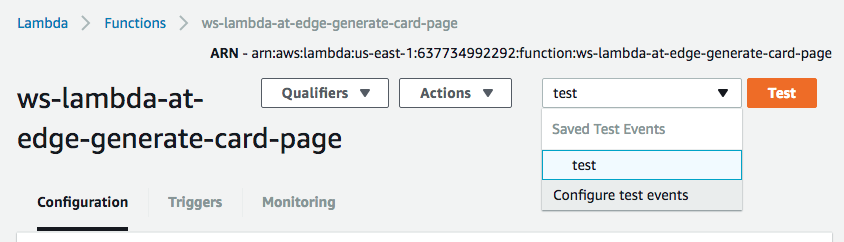
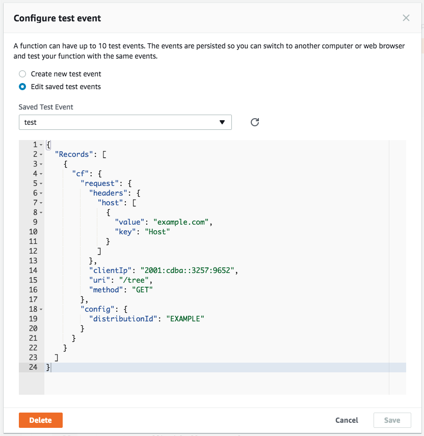

## Lab 4: Pretty URLs

In this lab, we will use Lambda@Edge to introduce pretty semantic URLs to our web application.

Pretty URLs are easy to read and remember. They also help with search engine ranking and allow your viewers to use the descriptive links in social media.

Currently, we display card details at the URL like this one:  
`(a)` https://d123.cloudfront.net/card/da8398f4  
an example of the corresponding semantic URL would be something like:  
`(b)` https://d123.cloudfront.net/tree

There are two common ways to serve content with pretty URLs:
* Redirect from semantic URLs similar to `(b)` to the URLs similar to `(a)` accepted by the origin
* Rewrite semantic URLs similar to `(b)` to URLs similar to `(a)` accepted by the origin. This can be done either at the origin itself or an intermediate proxy.

The URI rewrite approach has two advantages over the redirect:
* Faster content delivery as there is now need for an extra round-trip between the server and the client to handle the redirect
* The semantic URL stays in the address bar of the web browser

We will cover both of these approaches with Lambda@Edge.

## Steps

[1. Redirect response generation](#1-redirect-response-generation)  
[1.1 Create a Lambda function](#11-create-a-lambda-function)  
[1.2 Validate the function works in Lambda Console](#12-validate-the-function-works-in-lambda-console)  
[1.3 Publish a function version](#13-publish-a-function-version)  
[1.4 Create a cache behavior](#14-create-a-cache-behavior)  
[1.5 Redirects now work!](#15-redirects-now-work)  

[2. URI rewrite](#2-uri-rewrite)  
[2.1 Create/modify the Lambda function](#21-createmodify-the-lambda-function)  
[2.2 Validate the function works in Lambda Console](#22-validate-the-function-works-in-lambda-console)  
[2.3 Publish a function version](#23-publish-a-function-version)  
[2.4 Update the trigger](#24-update-the-trigger)  
[2.5 URI rewrite now works!](#25-uri-rewrite-now-works)  

### 1. Redirect response generation

Let's generate redirects from the named cards ("tree", "cat", etc) like  
https://d123.cloudfront.net/r/tree  

to the actual card URL  
https://d123.cloudfront.net/card/da8398f4

#### 1.1 Create a Lambda function

Go to Lambda Console, select "US East (N.Virginia)" region in the top left corner. Go to `Functions`, click `Create function` and click `Author from scratch`.

In the `Basic information` window, select:
* `Name`: `ws-lambda-at-edge-redirect`
* `Runtime`: `Node.js 6.10` or `Node.js 8.10`
* `Role`: `Choose an existing role`
* `Existing role`: `ws-lambda-at-edge-basic-<UNIQUE_ID>` (this allows the function to push the logs to CloudWatch Logs)

<kbd></kbd>

Use JavaScript code from [ws-lambda-at-edge-redirect.js](./ws-lambda-at-edge-redirect.js) as a blueprint.

Take a moment to familiarize yourself with the function code and what it does.

<kbd></kbd>

#### 1.2 Validate the function works in Lambda Console

Click `Save` and then `Test` and configure the test event. You can use `CloudFront Simple Remote Call` event template.

Specify `/r/tree` as the value of the `uri` field.

<kbd></kbd>

Click `Test` and validate the function has returned `302` status code with the location header value equal to `/card/da8398f4`.

<kbd></kbd>

#### 1.3 Publish a function version

Choose `Publish new version` under `Actions`, specify an optional description of a function version and click `Publish`.

#### 1.4 Create a cache behavior

Go to CloudFront Console and find the distribution created for this workshop.

Under the `Behaviors` tab, click `Create Behavior`. Choose the following settings:
* `Path Pattern`: `/r/*`
* `Viewer Protocol Policy`: `Redirect HTTP to HTTPS`
* `Lambda Function Associations`: `Origin Request` = `<lambda version ARN from the previous step>`
  
<kbd></kbd>

Wait for ~30-60 seconds for the change to propagate and for the Lambda function to get globally replicated.

#### 1.5 Redirects now work!

You can test it with command line:

```
curl --head https://d123.cloudfront.net/r/tree

HTTP/1.1 302 Moved Temporarily
Content-Length: 0
Connection: keep-alive
Server: CloudFront
Date: Tue, 21 Nov 2017 20:08:35 GMT
Location: /card/da8398f4
Age: 41
X-Cache: Hit from cloudfront
Via: 1.1 5d89a565ccf3467bf90667ebfc36953c.cloudfront.net (CloudFront)
X-Amz-Cf-Id: Qz81dgRMzEiac5P5cvxfuXXZRe7ub_MTUQ8PozB1t0ogSkBYSrRMXg==
```

Or by navigating you web browser to  
https://d123.cloudfront.net/r/tree  

which now should be redirected to  
https://d123.cloudfront.net/card/da8398f4  

### 2. URI rewrite

Let's rewrite the pretty URIs ("/tree", "/cat", etc) like  
https://d123.cloudfront.net/tree  
to he actual card URL  
https://d123.cloudfront.net/card/da8398f4  
internally within Lambda@Edge so that it's not even visible in the viewer web browser.

#### 2.1 Create/modify the Lambda function

Assuming Lab 2 has been completed, we already have Lambda@Edge function triggered for the origin-request event in the default cache behavior. We now need to rewrite the URI at the begging of it before any further processing.

This can be achieved with the code snippet below. Paste it at the beginning of the handler defined in function `ws-lambda-at-edge-generate-card-page` created in Lab 2.

```
    const redirects = {
        '/music':    '/card/bcbd2481',
        '/tree':     '/card/da8398f4',
        '/food':     '/card/e51c848c',
        '/computer': '/card/fe2f80a7',
        '/cat':      '/card/k9b430fc',
        '/beer':     '/card/vc7efa69',
    };
    if (request.uri in redirects) {
        request.uri = redirects[request.uri];
    }
```

<kbd></kbd>

#### 2.2 Validate the function works in Lambda Console

Update the test event - click `Configure test events` inside the dropdown list of test events next to the `Test` button.

<kbd></kbd>

Change the `uri` field value to `/tree`.

<kbd></kbd>

#### 2.3 Publish a function version

Choose `Publish new version` under `Actions`, specify an optional description of a function version and click `Publish`.

#### 2.4 Update the trigger

Either in Lambda or CloudFront Console update the origin-request event in the default cache behavior (`*` path pattern) of the CloudFront distribution to trigger the function version ARN obtained at the previous step.

Wait for ~30-60 seconds for the change to propagate and for the Lambda function to get globally replicated.

#### 2.5 URI rewrite now works!

Now both URLs show exactly the same content.

* https://d123.cloudfront.net/tree
* https://d123.cloudfront.net/card/da8398f4  
