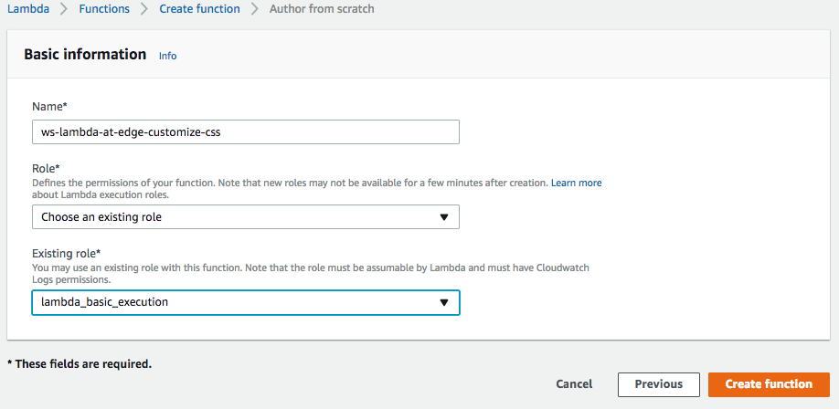
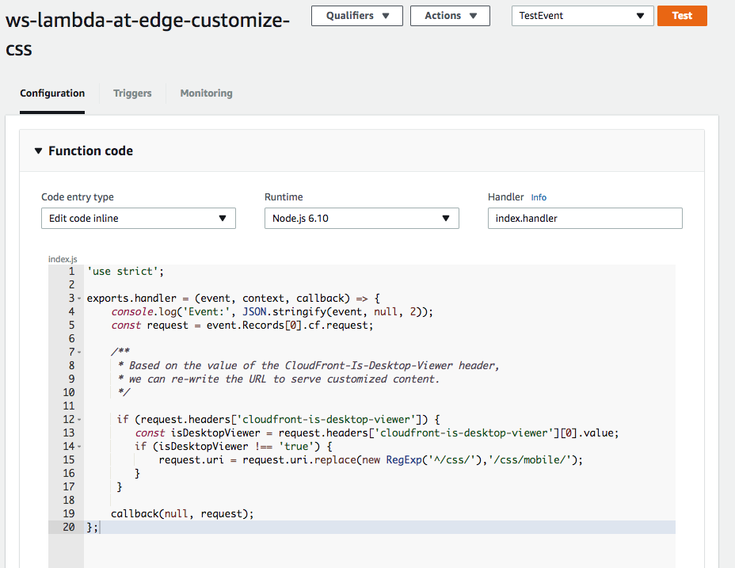
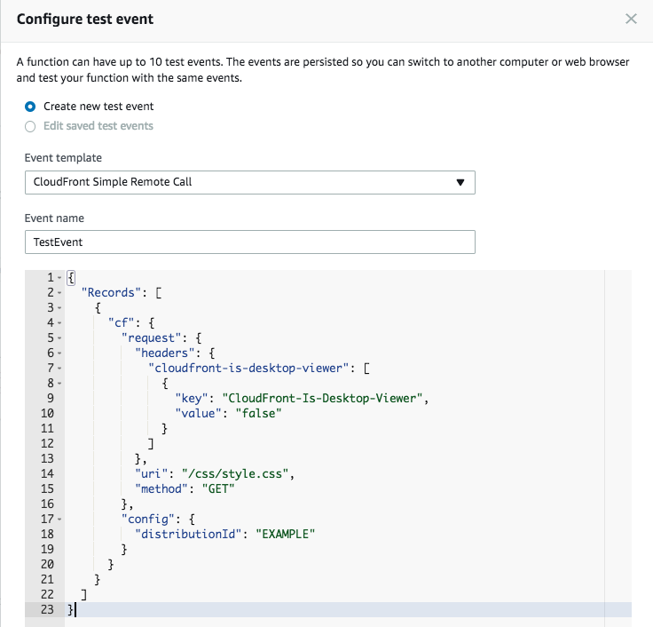
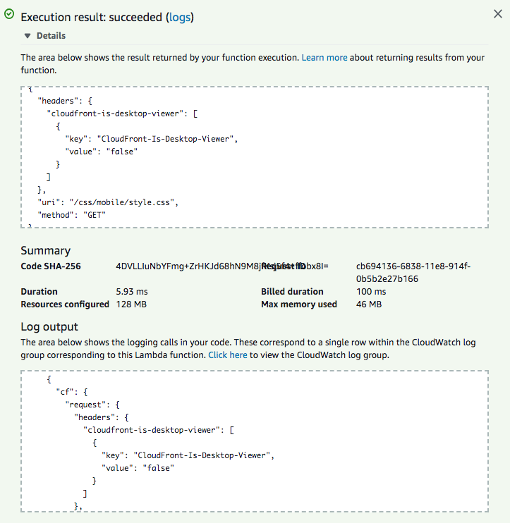
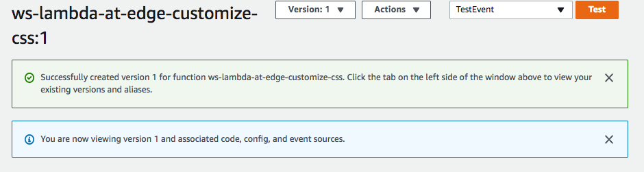
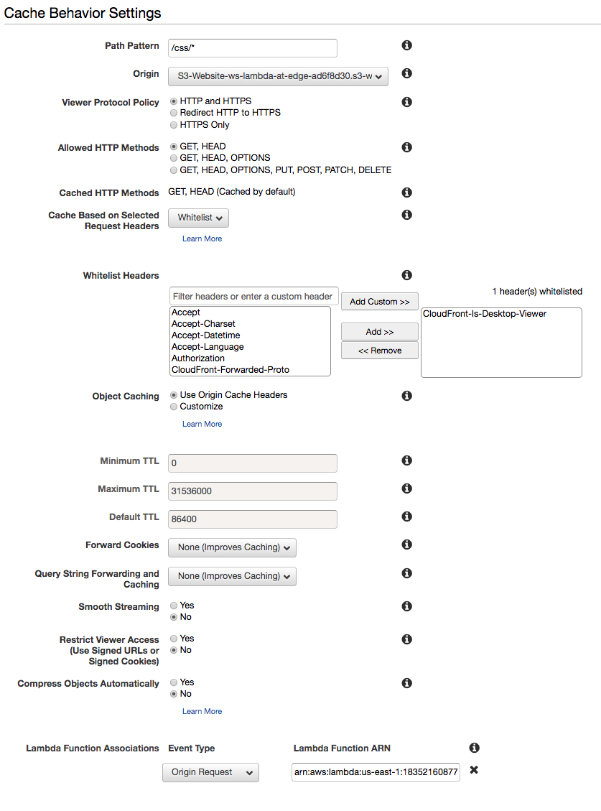
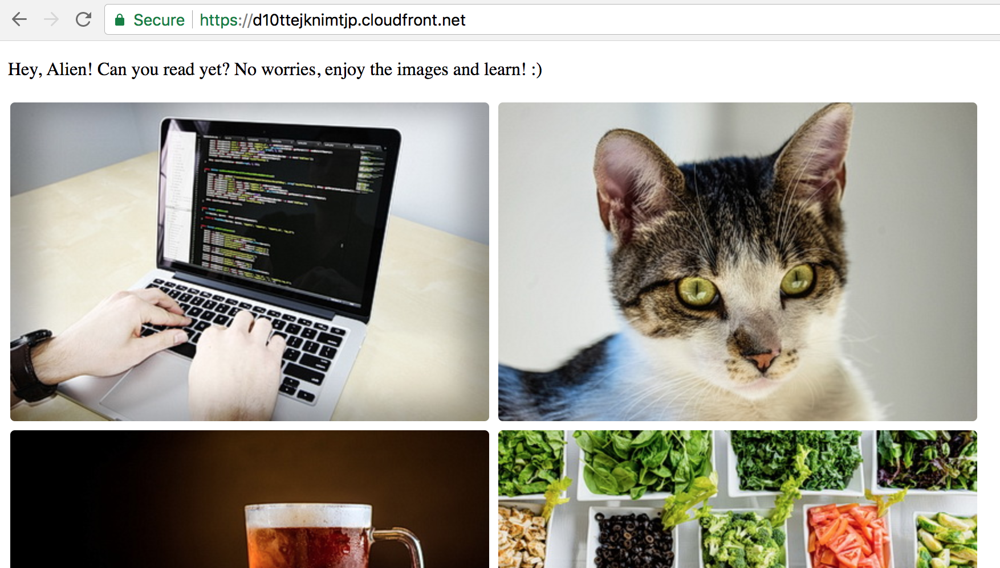
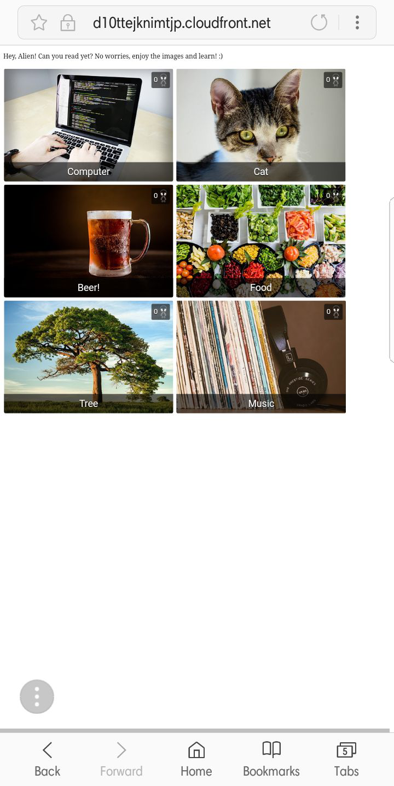

## Lab 5 - Content Customization

In this lab, you will learn how to create a Lambda function that customizes the content based on request properties.

If you open the homepage of the CloudFront distribution, you set up in previous steps, on a mobile phone, you won't be able to see card descriptions and ratings as you can't hover over an HTML element without a pointer device on a mobile phone. If you try to hover, you may end up clicking it and landing on the detail page. While popping up elements look cool on a desktop, this is a poor viewer experience on a mobile device. We can fix this by keeping the hover effect only for desktop devices, while disaling it for mobile viewers who can just always see all descritpions and ratings without hovering over them.

In this lab, we will serve different CSS based on viewer device type. If a request if comes from a mobile device, we will serve a different CSS which always show the title and ratings on home page. 

We can serve customized content from an S3 bucket by changing the path prefix depending on the CloudFront device type headers like:
* CloudFront-Is-Mobile-Viewer
* CloudFront-Is-Desktop-Viewer

For example:

* GET /css/style.css

can be rewritten to

* GET /css/style.css (for desktop viewers)
* GET /css/mobile/style.css (for mobile viewers)

**NOTE:** Here and below throughout the workshop, replace the example domain name `d123.cloudfront.net` with the unique name of your distribution.

## Steps

[1. Create a Lambda function](#1-create-a-lambda-function)  
[2. Validate the function works in Lambda Console](#2-validate-the-function-works-in-lambda-console)  
[3. Publish a function version](#3-publish-a-function-version)  
[4. Create a new cache behavior for the CSS files](#4-create-a-new-cache-behavior-for-the-css-files)  
[5. Wait for the change to propagate](#5-wait-for-the-change-to-propagate)  
[6. The generated home page is now delivering CSS customized for the device type!](#7-the-generated-home-page-is-now-delivering-css-customized-for-the-device-type)

### 1. Create a Lambda function

Go to Lambda Console, select "US East (N.Virginia)" region in the top left corner. Go to `Functions`, click `Create function` and click `Author from scratch`.

In the `Basic information` window, select:
* `Name`: `ws-lambda-at-edge-customize-css`
* `Runtime`: `Node.js 6.10` or `Node.js 8.10`
* `Role`: `Choose an existing role`
* `Existing role`: `ws-lambda-at-edge-basic-<UNIQUE_ID>` (this allows the function to push the logs to CloudWatch Logs)

<kbd></kbd>

Use JavaScript code from [ws-lambda-at-edge-customize-css.js](./ws-lambda-at-edge-customize-css.js) as a blueprint.

Take a moment to familiarize yourself with the function code and what it does.

<kbd></kbd>

### 2. Validate the function works in Lambda Console

Click `Save` and then `Test` and configure the test event. Use the test event from [ws-lambda-at-edge-customize-css-test-event.json](./ws-lambda-at-edge-customize-css-test-event.json). Set the `uri` value to `css/style.css`.

<kbd></kbd>

Click `Test` and validate the function has returned `200` status code and the `uri` has been updated to `/css/mobile/style.css`.

<kbd></kbd>

### 3. Publish a function version

Choose `Publish new version` under `Actions`, specify an optional description of a function version and click `Publish`.

<kbd></kbd>

### 4. Create a new cache behavior for the CSS files

Go to CloudFront Console and find the distribution created for this workshop.

Under the `Behaviors` tab, click `Create Behavior`. Choose the following settings:

* `Path Pattern`: `/css/*`
* `Cache Based on Selected Request Headers`: `Whitelist`
* `Whitelist Headers`: Type in `CloudFront-Is-Desktop-Viewer` and click `Add Custom >>`
* `Lambda Function Associations`: `Origin Request` = `<lambda version ARN from the previous step>`

Click `Create`.

<kbd></kbd>

### 5. Wait for the change to propagate

Wait for ~30-60 seconds for the change to propagate and for the Lambda function to get globally replicated.

### 6. The generated home page is now delivering CSS customized for the device type!

Go to the distribution home page (from desktop):  
https://d123.cloudfront.net/

You should be seeing a page like this:

<kbd></kbd>

Go to the distribution home page (from mobile):  
https://d123.cloudfront.net/

You should be seeing a page like this:

<kbd></kbd>

