## Lab 6 - Dynamic Origin Selection

Consider a scenario, where you have more than one origin, and on cache misses you want to route your request to an appropriate origin based on request attributes. 
In this lab, you will learn how to create a Lambda function that changes S3 origin region based on country of the viewer to serve content from an S3 bucket in nearer region for lower latencies.

You can front multiple backend origin application services with Amazon CloudFront and use Lambda@Edge to route requests to the appropriate origin dynamically, based on the attributes of the request. For example, you can have multiple microservices based backend origins that your Lambda@Edge functions can dynamically route to by inspecting request attributes like query strings, headers or cookies. Or you can route your viewers to the most optimal origin for latency or data locality if it is meant to run geographically distributed applications in different AWS regions. Content-based dynamic origin selection also lets you simplify your origin infrastructure by moving request routing logic from a fleet of reverse proxy servers that you would have had to manage to serverless Lambda@Edge functions.

**NOTE:** Here and below throughout the workshop, replace the example domain name `d123.cloudfront.net` with the unique name of your distribution.

Currently the images served by your CloudFront distribution are read from an S3 bucket located in "EU (Frankfurt)" region. 

As part of this lab, we will create a new lambda function which will inspect `CloudFront-Viewer-Country` header, set by CloudFront, to find the country of the viewer and if the viewer is located in United States or Canada, origin is updated to bucket in "US West (Oregon)" region. On completion of this lab, depending upon viewer country of the users of this lab, the average response time might change. For example, for users in US and Canada, since "US West (Oregon)" is nearer than "EU (Frankfurt)", the average response time should be considerably lesser.

## Steps

[1. Create new cache behavior for images](#1-create-new-cache-behavior-for-images)  
[2. Get average time to fetch an image from an S3 origin](#2-get-average-time-to-fetch-an-image-from-an-s3-origin)  
[3. Create a Lambda function](#3-create-a-lambda-function)  
[4. Validate the function works in Lambda Console](#4-validate-the-function-works-in-lambda-console)  
[5. Publish a function version](#5-publish-a-function-version)  
[6. Update cache behavior for images](#6-update-cache-behavior-for-images)  
[7. Wait for the change to propagate](#7-wait-for-the-change-to-propagate)  
[8. Verify change in average time to fetch an image from S3 origin](#8-verify-change-in-average-time-to-fetch-an-image-from-s3-origin)  
[9. Update cache behavior to allow object caching](#9-update-cache-behavior-to-allow-object-caching)  

### 1. Create new cache behavior for images

To calculate the average response time to fetch an image from S3 origin in "EU (Frankfurt)" region, create a new cache behaviour with TTL set to 0. On setting TTL to 0, CloudFront doesn't cache the objects and the request is always sent to origin.

Jump to CloudFront console, click on distribution ID and under `Behaviors` tab, click on `Create Behavior`. Choose the following Cache Behavior settings:
* `Path Pattern`: `/card/*.jpg`
* `Viewer Protocol Policy`: `Redirect HTTP to HTTPS`
* `Object Caching`: `Customize`
* `Minimum TTL`: `0`
* `Maximum TTL`: `0`
* `Default TTL`: `0`

Click `Create`

<kbd>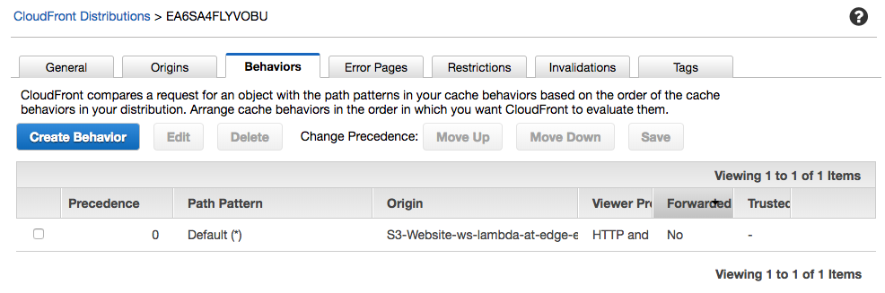</kbd>

<kbd>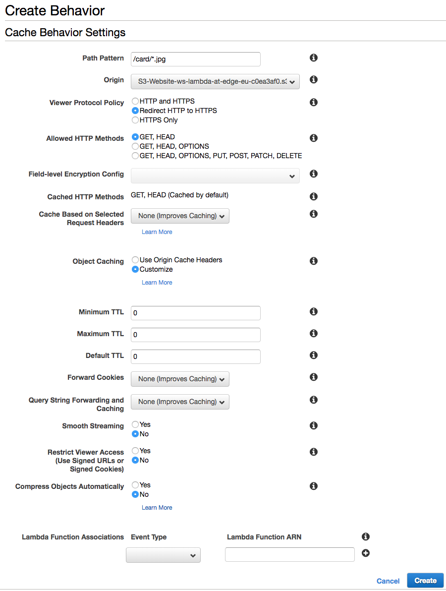</kbd>

### 2. Get average time to fetch an image from an S3 origin

Open [https://d123.cloudfront.net/get_average_response_time.html](https://d123.cloudfront.net/get_average_response_time.html) to send few requests to fetch an image from an S3 origin and get the average response time. Make a note of this resultant average response time.

<kbd>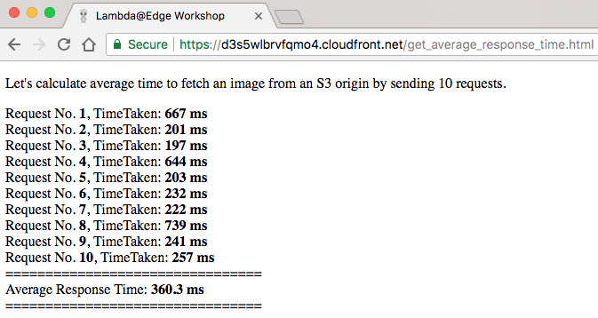</kbd>

### 3. Create a Lambda function

Similar to how we did it in the previous labs, create a Lambda function in "US East (N.Virginia)" region.

In the `Basic information` window, specify:
* `Name`: `ws-lambda-at-edge-select-nearer-origin`
* `Runtime`: `Node.js 6.10` or `Node.js 8.10`
* `Role`: `Choose an existing role`
* `Existing role`: `ws-lambda-at-edge-read-only-<UNIQUE_ID>` (this role allows the function to read data from the DynamoDB table and also get object from the S3 bucket)

Use JavaScript code from [ws-lambda-at-edge-select-nearer-origin.js](./ws-lambda-at-edge-select-nearer-origin.js) as a blueprint.

<kbd>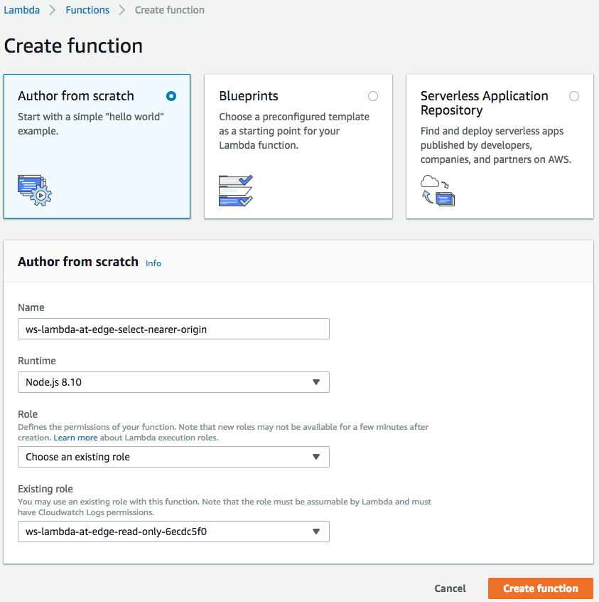</kbd>

<kbd>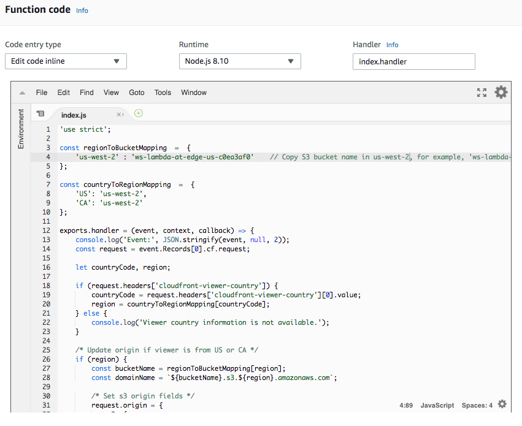</kbd>

### 4. Validate the function works in Lambda Console

Click `Save` and then `Test` and configure the test event. Create new test event and use [ws-lambda-at-edge-select-nearer-origin-test-input.json](./ws-lambda-at-edge-select-nearer-origin-test-input.json) as a test input.

<kbd>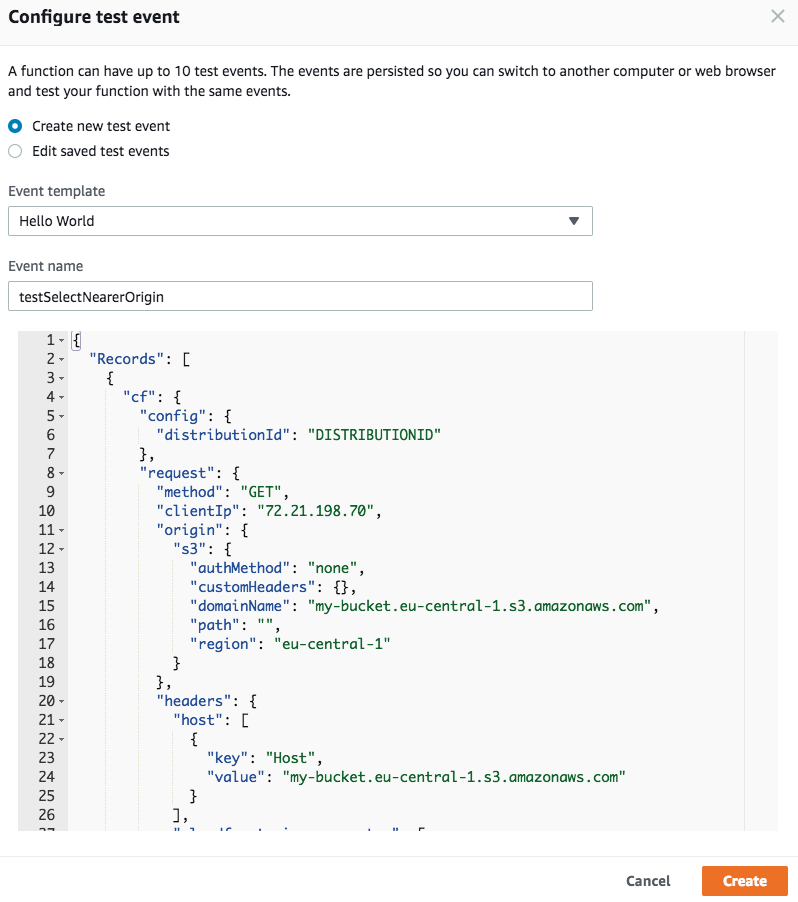</kbd>

Execute the test-invoke and validate that function execution succeeds and the origin refers to a bucket in "US West (Oregon)".

<kbd>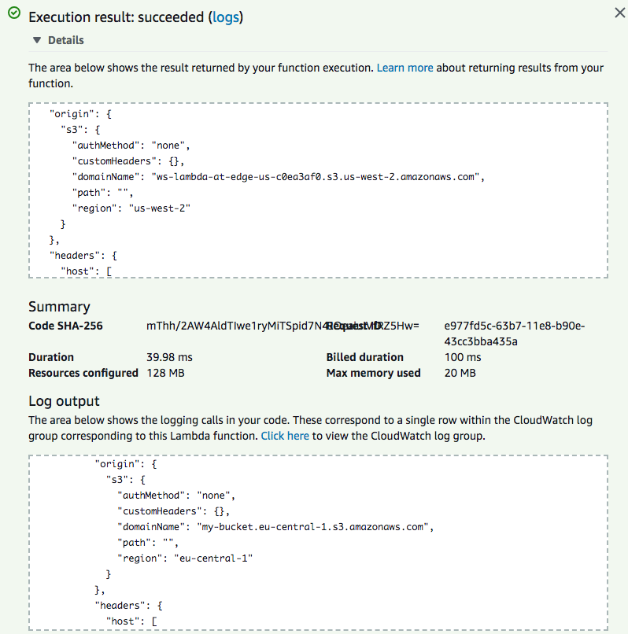</kbd>

### 5. Publish a function version

Choose "Publish new version" under "Actions", specify an optional description of a function version and click "Publish".

<kbd>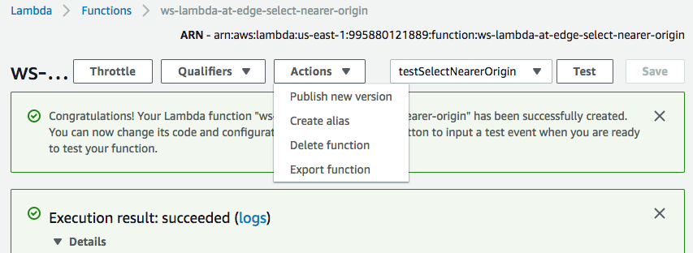</kbd>

<kbd>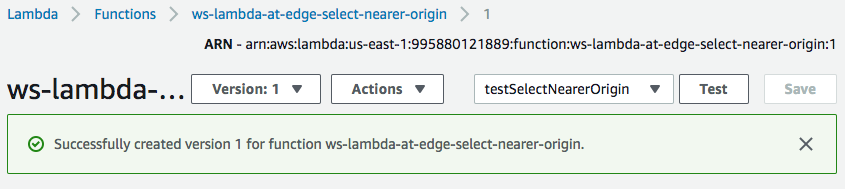</kbd>

### 6. Update cache behavior for images

Jump to CloudFront console and under the "Behaviors" tab, select entry with Path Pattern `/card/*.jpg`, click `Edit` and update following settings:
* `Cache Based on Selected Request Headers`: `Whitelist`
* `Whitelist Headers`: Select `CloudFront-Viewer-Country` and click `Add >>`
* `Lambda Function Associations`: `Origin Request` = `<lambda version ARN from the previous step>`

 Click `Yes, Edit`

<kbd>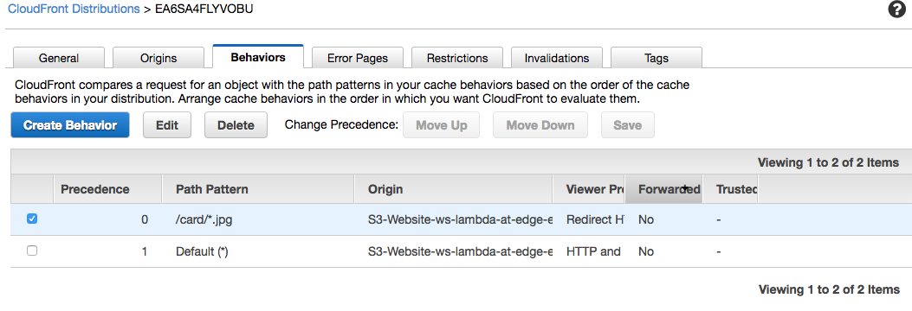</kbd>

<kbd>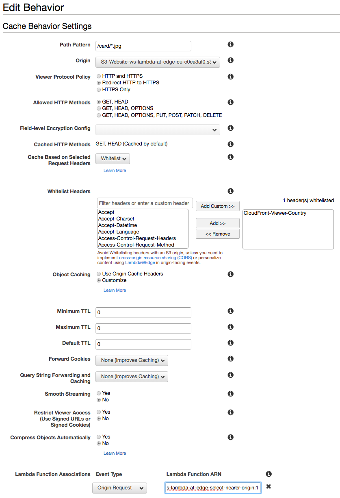</kbd>

### 7. Wait for the change to propagate

Wait for ~30-60 seconds for the change to propagate and for the Lambda function to get globally replicated.

### 8. Verify change in average time to fetch an image from S3 origin

Again open [https://d123.cloudfront.net/get_average_response_time.html](https://d123.cloudfront.net/get_average_response_time.html) to send few requests to fetch an image from an S3 origin and get the average response time. For users in US and CA, the average response time should now be considerably lesser as compared against fetching an image from an S3 bucket in "EU (Frankfurt)" region.

<kbd>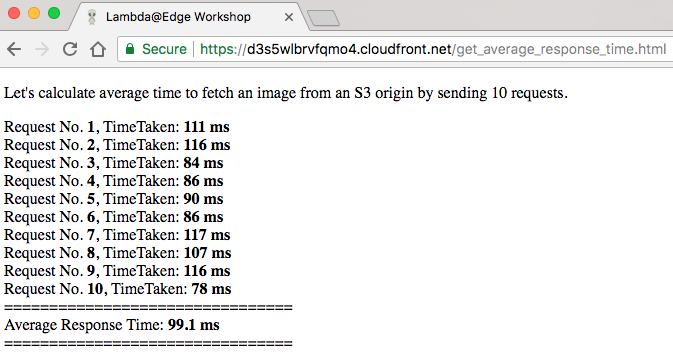</kbd>

### 9. Update cache behavior to allow object caching

In step 1, we had disabled object caching for images by setting TTL to 0 to demonstrate how origin selection feature can be used to further reduce latencies based on `CloudFront-Viewer-Country` header. Let's change back the TTL setting to default so as to enable object caching again.

Jump to CloudFront console and under the "Behaviors" tab, select entry with Path Pattern `/card/*.jpg`, click "Edit" and update following settings:
* `Object Caching`: `Use Origin Cache Headers`

Click `Yes, Edit`

<kbd></kbd>

<kbd>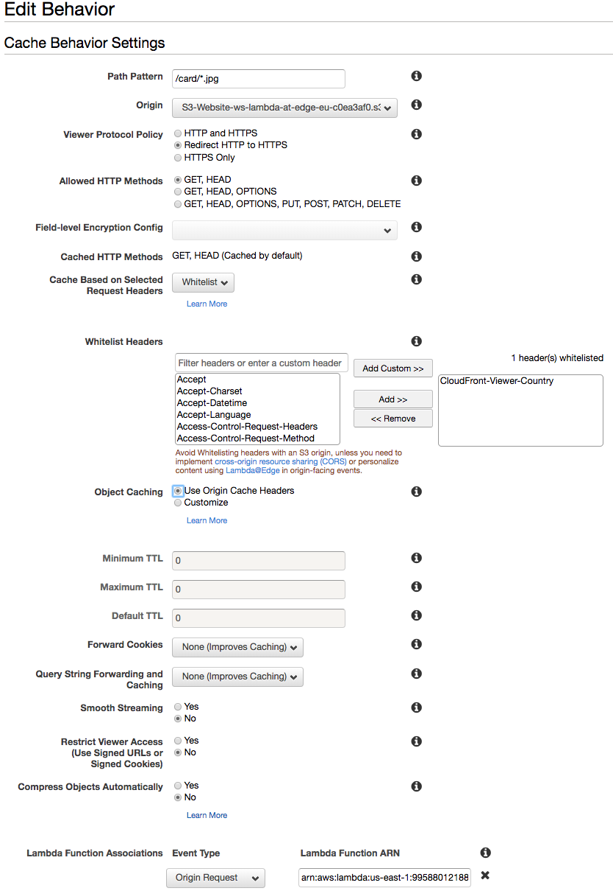</kbd>